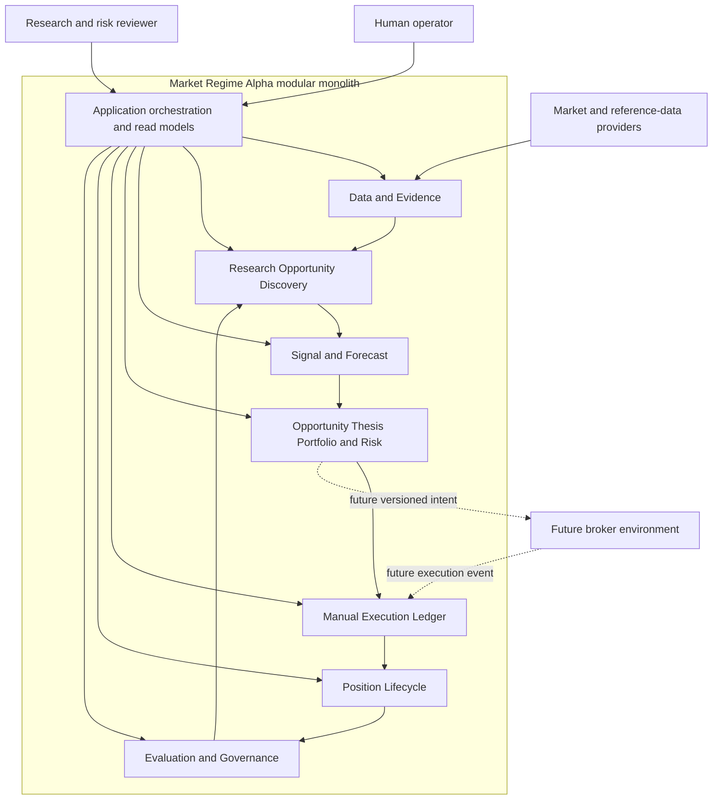
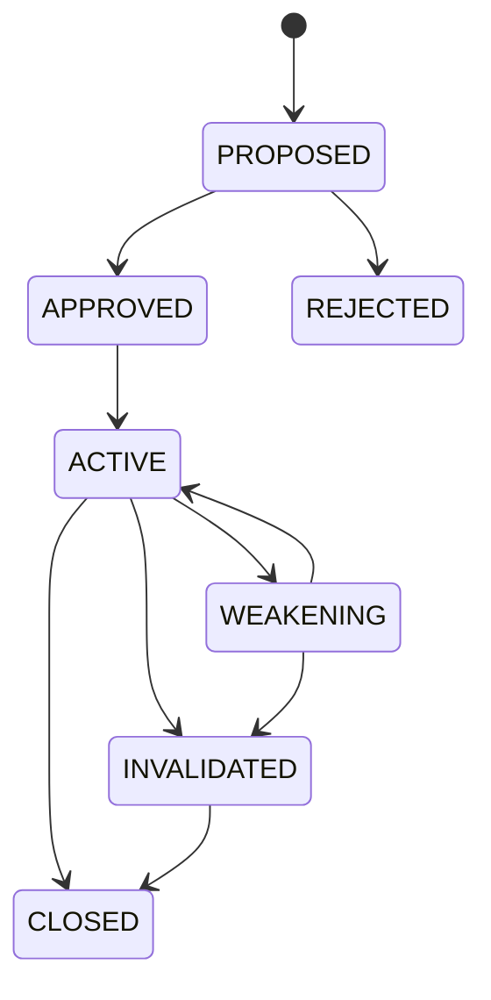
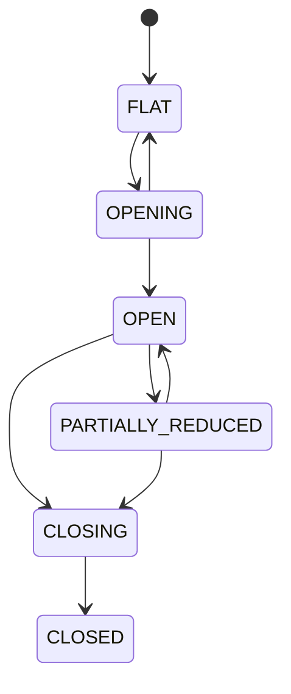

# Production Decision Lifecycle

> **Status:** CURRENT_ARCHITECTURE  
> **Authority:** Target architecture for the production decision-support lifecycle  
> **Owner:** Market Regime Alpha maintainers  
> **Last Updated:** 2026-08-01  
> **Supersedes:** None  
> **Superseded By:** None  
> **Related Documents:** 01-Domain-Boundaries.md, 09-Platform-Architecture-V2.md, decisions/ADR-004-Production-Decision-Lifecycle-Organization.md, ../specs/Production-Decision-Lifecycle-Requirements.md, ../roadmap/work-packages/WP-PDL-Production-Decision-Lifecycle.md  
> **Code Evidence:** `feat/production-decision-lifecycle`; Phase 0–7 engineering status is recorded in Current State and the delivery audit. Qualified production operation remains a target, not an implementation claim.

## 1. Purpose

This document defines how the existing evidence and research platform evolves into a production-grade, human-in-the-loop decision-support system for A-share trading.

The architecture does not attempt to guarantee that the next session rises. It creates a controlled chain from observable evidence to research, trade opportunity, thesis, risk approval, manual execution, authoritative position state, holding/exit assessment and outcome attribution.

The production boundary for the first delivery remains:

```text
research + simulation + manual execution record
```

Unattended live broker mutation remains outside the authorized system boundary.

## 2. Current foundation

The current repository already provides:

- stable domain identities and semantic time types;
- Provider, SourceArtifact, Dataset and DataEligibility contracts;
- field-level SourceManifest and immutable source archives;
- point-in-time Universe and Trading Eligibility contracts;
- FeatureDefinition and FeatureMaterialization contracts;
- recoverable DailyRun Runtime Journal with compare-and-set transitions;
- immutable, content-addressed artifacts and deterministic readers/replay;
- executable Market Regime, Theme Rotation, Capital Evolution and Candidate Discovery research flow;
- versioned Signal, Forecast, Decision, Portfolio, Execution, Position and Evaluation boundaries;
- model lifecycle and experiment-governance rules;
- exploratory MR1 recommendation, entry plumbing, outcome settlement and review.

The Phase 0–7 delivery adds the operational bridge, Signal/Path engineering,
durable governance, Opportunity/Thesis, independent Portfolio/Risk, manual Fill
ledger, Fill-derived Position, independent Holding/Exit and closed-trade review.
It does not provide qualified operational evidence, validated parameters,
production authentication, a production operator surface or a broker adapter.

## 3. Architecture decision

The system shall remain one repository and one modular Python application until a runtime boundary has a demonstrated independent deployment need.

The organizational model is:

```text
modular monolith now
+ explicit ports and immutable contracts
+ optional independent broker agent later
```

The only anticipated early independent deployment is a future Windows broker agent required by QMT/PTrade or similar client-bound environments. That agent shall consume versioned order intent and emit execution events; it shall not own research, model, portfolio or position truth.

## 4. System context



## 5. Layer model

| Layer | Owned truth | Outputs | Forbidden authority |
|---|---|---|---|
| L0 Data and Evidence | source bytes, time, lineage, data quality, PIT population | SourceManifest, snapshots, feature materialization | model rank, trade decision |
| L1 Research Discovery | market, theme, capital and candidate research | ResearchLayerArtifact, CandidateSet | buy/sell, actual position |
| L2 Signal and Forecast | entry structure and path-risk estimates | SignalSnapshot, PathForecast | portfolio allocation, order |
| L3 Decision and Risk | opportunity, thesis, portfolio and hard-risk approval | TradingOpportunity, TradingThesis, PortfolioDecision, RiskDecision | actual fill or position truth |
| L4 Execution and Position | manual intent, order/fill record, position projection | ManualTradeRecord, Fill, PositionSnapshot, Holding/Exit assessment | model promotion |
| L5 Evaluation and Governance | outcomes, attribution, scorecards, model lifecycle | EvaluationReport, AttributionReport, lifecycle transitions | automatic model mutation |

The dependency direction is strictly downward. Application services may orchestrate layers but must not redefine their owned entities.

The first L2 implementation binds five Signal confirmations to exact
CandidateSet/source evidence and embeds the existing EntryPathTarget contract
inside each explicit PathForecast configuration. Decision clock, barriers,
horizon, thresholds, sample count and quantile levels are versioned inputs, not
domain constants or production defaults. Unavailable or late evidence fails
closed; an uncalibrated PathForecast exposes no event probability.

## 6. Target module map

```text
src/market_regime_alpha/
├── core/                         # stable IDs, semantic time, shared primitives
├── data/                         # providers, SourceManifest, dataset authority
├── evidence/                     # immutable artifact and authority envelopes
├── universe/                     # PIT stock/ETF universe and eligibility
├── features/                     # feature definition/materialization/registry
├── research/                     # market/theme/capital/candidate research
├── signals/                      # executable Signal Engine
├── forecasting/                  # next-session and multi-horizon path forecasts
├── decision/                     # opportunity, thesis and risk-decision contracts
├── portfolio/                    # portfolio construction and target positions
├── execution/                    # simulation and manual execution ledger
├── position/                     # position projection, holding and exit
├── evaluation/                   # outcomes, attribution and scorecards
├── platform/                     # model and experiment governance
└── application/
    ├── daily_loop/               # current source-to-daily-artifact runtime
    ├── research_layer/           # current offline Platform V2 runner
    ├── operational_research/     # implemented exploratory Daily Artifact → Research bridge
    └── trading_lifecycle/        # implemented decision/manual/review orchestration
```

`daily_decision/**` remains the fixed exploratory MR1 10:30 path. It must not be repurposed as the general production decision lifecycle.

`daily_research/**` remains a historical compatibility surface. New business behavior must not be added there.

## 7. Core data flow

```mermaid
flowchart LR
    Raw[Raw provider bytes]
    Manifest[SourceManifest]
    PIT[PIT universe and eligibility]
    Features[Feature materializations]
    Research[Market Theme Capital Candidate]
    Signal[SignalSnapshot]
    Forecast[PathForecast]
    Opportunity[TradingOpportunity]
    Thesis[TradingThesis]
    Portfolio[PortfolioDecision]
    Risk[RiskDecision]
    Manual[Manual intent and fills]
    Position[PositionSnapshot]
    Assessment[Holding and Exit]
    Attribution[Outcome and Attribution]

    Raw --> Manifest
    Manifest --> PIT
    PIT --> Features
    Features --> Research
    Research --> Signal
    Signal --> Forecast
    Forecast --> Opportunity
    Research --> Opportunity
    Opportunity --> Thesis
    Thesis --> Portfolio
    Portfolio --> Risk
    Risk --> Manual
    Manual --> Position
    Position --> Assessment
    Assessment --> Manual
    Position --> Attribution
    Attribution -. controlled research feedback .-> Research
```



## 8. Authority model

### 8.1 Evidence authority

Immutable content-addressed artifacts remain the authority for result-affecting evidence. Operational databases may index artifacts but shall not become an alternative mutable copy of their semantics.

### 8.2 Runtime authority

The Daily Runtime Journal remains the authority for daily-stage progress, failure and recovery. New application workflows shall use their own aggregate repositories but shall not create a second daily acquisition state machine.

### 8.3 Execution authority

For the first release, actual execution authority is the Manual Execution Ledger. A plan, recommendation or target position is not an actual order or position.

### 8.4 Position authority

PositionSnapshot is a projection from valid fills. It shall be reproducible from the append-only fill ledger and shall never be created from a model recommendation alone.

### 8.5 Governance authority

Model Registration and Experiment Protocol state shall become durable. Lifecycle transitions remain validated by existing domain rules; persistence does not gain permission to bypass them.

## 9. Operational research bridge

The existing DailyLoop and Platform V2 runners are intentionally independent. The target bridge shall:

1. load a verified Daily Decision or Source Archive;
2. verify SourceManifest, Universe, Eligibility, Decision Price and Feature lineage;
3. build typed market, theme, capital, ETF and symbol observations;
4. enforce Availability Time at or before Decision Time;
5. preserve input artifact IDs and hashes;
6. emit a ResearchInputBundle using only supported evidence kinds;
7. fail closed when required mappings or observations are absent;
8. run PlatformResearchRunner without changing DailyLoopRunner responsibilities.

The bridge must not copy raw data into a second provider path and must not label current public data as formal PIT.

## 10. Research responsibilities

### 10.1 Market Regime

Market Regime owns market state, research permission and maximum gross exposure guidance. It is a context gate, not an entry signal.

### 10.2 Theme Rotation and lifecycle

The existing V0 is a one-snapshot ranking and classification model. Future lifecycle behavior shall use historical state, duration and hysteresis rather than pretending a direct score-to-label mapping is a temporal state machine.

Recommended split:

- `ThemeRotationSnapshot`: cross-sectional theme priority;
- `ThemeLifecycleSnapshot`: path-dependent state and transition evidence.

### 10.3 Capital observables and lifecycle

Recommended split:

- `CapitalObservableSnapshot`: measurable relative strength, amount, breadth, participation, concentration and persistence;
- `CapitalLifecycleSnapshot`: inferred state over current and previous observable snapshots.

The existing `CapitalEvolutionSnapshot` remains readable and supported as V0.

### 10.4 Candidate Discovery

Candidate Discovery consumes complete population, eligibility and approved research components. It preserves every symbol with explicit status and reasons. CandidateSet remains research output and never becomes a direct order list.

Theme and Capital overlap shall be evaluated through ablation before Candidate Discovery V3 changes weights or gates.

## 11. Signal Engine

The first executable Signal Engine shall use decision-time observable features only:

- price action;
- volume confirmation;
- trend confirmation;
- VWAP context;
- overheat state.

MACD, moving averages and similar indicators may be feature inputs but shall not be separate authority layers.

Each SignalSnapshot shall bind:

- symbol;
- CandidateSet artifact;
- Decision Time;
- feature IDs and materializations;
- signal model and configuration;
- state and score;
- confidence;
- reason codes;
- immutable envelope.

Signal states shall remain `INACTIVE`, `WATCH`, `CONFIRMED_FOR_RESEARCH` or `DATA_INSUFFICIENT` until separate promotion evidence authorizes stronger semantics.

## 12. Multi-horizon path forecast

The existing NextSessionForecast remains unchanged. A separate PathForecast shall represent longer and path-dependent trade research.

Minimum fields:

```text
forecast_id
symbol
target_id
forecast_horizon
upper_barrier
lower_barrier
return_quantiles
expected_return
expected_adverse_excursion
expected_favorable_excursion
confidence
calibration_status
reason_codes
```

The implementation shall reuse EntryPathTarget contracts where applicable. Daily OHLC dual-touch ambiguity remains explicit.

## 13. Trading Opportunity

TradingOpportunity is the first object that states a symbol may be considered for a trade. It is still not an order.

Suggested aggregate fields:

```text
opportunity_id
candidate_set_id
symbol
primary_theme_id
signal_snapshot_ids
forecast_id
decision_time
valid_until
opportunity_state
expected_reward
expected_risk
confidence
reason_codes
version
```

Invariants:

- all referenced artifacts verify;
- Decision Time and symbol scopes align;
- expired opportunities cannot be triggered;
- data-insufficient signal or forecast cannot create READY;
- creation is idempotent for the same evidence and strategy configuration.

## 14. Trading Thesis

TradingThesis records why a human is considering or holding exposure.

Suggested fields:

```text
thesis_id
opportunity_id
strategy_id
symbol
entry_rationale
supporting_evidence_ids
invalidation_conditions
time_invalidation
thesis_state
approved_by
approved_at
version
```

A thesis is mutable state over immutable supporting evidence. Every state transition appends an audit event.

The thesis states are:



An invalidated thesis cannot authorize ADD.

## 15. Portfolio and Risk Authority

Portfolio construction owns target allocation; Risk Authority owns hard permission.

Portfolio inputs include:

- active theses;
- current authoritative positions;
- available cash;
- market exposure ceiling;
- per-symbol and per-theme limits;
- liquidity and capacity assumptions;
- T+1 availability;
- loss budget and portfolio drawdown state.

RiskDecision must be append-only and include the exact limit snapshot and reason codes used. A timeout or unavailable risk service produces rejection, not implicit approval.

## 16. Manual execution and position projection

### 16.1 ManualTradeRecord

ManualTradeRecord shall capture:

- approved source decision;
- intended symbol, side, quantity and price range;
- operator identity;
- confirmation or rejection;
- operator reason;
- idempotency key;
- state and version.

### 16.2 Fill

Fill is append-only and includes:

- fill ID;
- trade intent ID;
- symbol and side;
- quantity, price and fee;
- fill time;
- source and actor;
- optional correction reference.

### 16.3 Position projection



A-share constraints such as T+1, suspension and limit-up/limit-down execution availability belong to execution and position assessment, not to Candidate Discovery.

## 17. Holding and Exit

Holding and Exit are independent model roles.

HoldingAssessment considers:

- thesis validity;
- market, theme and capital state change;
- updated price/volume/trend signal;
- current MFE/MAE;
- portfolio risk and opportunity cost.

ExitAssessment considers:

- hard invalidation;
- risk-stop conditions;
- state collapse or exhaustion;
- time invalidation;
- alternative exit policy and benchmark controls.

Possible outputs:

| Holding | Exit |
|---|---|
| HOLD | WAIT |
| ADD | WAIT |
| WAIT | DATA_INSUFFICIENT |
| DATA_INSUFFICIENT |  |
|  | REDUCE |
|  | EXIT |

REDUCE is owned by the Exit role in V1. `NO_ACTION` remains distinct from HOLD
in existing contracts and is not introduced as an alias by the new assessment.

ADD always requires a new PortfolioDecision and RiskDecision.

## 18. Evaluation and attribution

Evaluation shall be layer-specific. A complete trade review should calculate:

- realized return and cost;
- MFE and MAE;
- return capture ratio;
- candidate selection contribution;
- entry timing contribution;
- holding and exit contribution;
- portfolio sizing contribution;
- manual execution deviation;

The Phase 7 V1 attribution values are diagnostics, not an identified causal
decomposition. They cannot mutate Model Registry state, model weights or
promotion decisions.
- market and theme conditional slices;
- model/configuration/evidence references.

Attribution may propose research work but shall not mutate a model or promote it automatically.

## 19. Persistence design

### 19.1 Storage split

| Store | Responsibility |
|---|---|
| Immutable file/object artifact store | source, research, signal, forecast and evaluation evidence |
| PostgreSQL | default runtime journals, domain ledgers and durable governance authority |
| SQLite | explicit compatibility, historical replay and one-time import source |

PostgreSQL and SQLite implement the same bounded Repository protocols. Runtime
composition selects exactly one authority; it never dual-writes or silently
falls back. Canonical JSON remains text so storage cannot normalize bytes that
participate in hashes. Immutable file Artifacts remain outside the database.

### 19.2 Suggested operational tables

- `artifact_index`;
- `model_registration`;
- `model_transition`;
- `experiment_protocol`;
- `experiment_access`;
- `trading_opportunity`;
- `trading_thesis`;
- `portfolio_decision`;
- `target_position`;
- `risk_decision`;
- `manual_trade_record`;
- `manual_fill`;
- `position_projection`;
- `position_assessment`;
- `attribution_report`;
- `audit_event`;
- `outbox_event`.

All mutable aggregate tables shall include a version column. All command-facing writes shall include an idempotency key or deterministic identity.

## 20. Interface model

Application commands:

- `RunOperationalResearch`;
- `CreateTradingOpportunity`;
- `CreateTradingThesis`;
- `EvaluatePortfolio`;
- `ApproveRiskDecision`;
- `RecordManualTradeIntent`;
- `RecordManualFill`;
- `ReconcilePosition`;
- `AssessOpenPositions`;
- `CloseTradingThesis`;
- `PublishAttribution`;
- `TransitionModel`.

Application queries:

- `GetDailyPlan`;
- `GetOpportunityDetail`;
- `GetActiveTheses`;
- `GetPositionHealth`;
- `GetExecutionReconciliation`;
- `GetModelScorecard`;
- `GetAuditTrace`.

The first adapters may be CLI commands. A future FastAPI surface shall call these application services rather than recomputing canonical research.

## 21. Error model

Standard error codes should include:

- `DATA_BLOCKED`;
- `EVIDENCE_MISMATCH`;
- `ARTIFACT_NOT_VERIFIED`;
- `OPPORTUNITY_EXPIRED`;
- `THESIS_INVALIDATED`;
- `RISK_REJECTED`;
- `VERSION_CONFLICT`;
- `IDEMPOTENCY_CONFLICT`;
- `POSITION_MISMATCH`;
- `RECONCILIATION_REQUIRED`;
- `PERMISSION_DENIED`;
- `MODEL_NOT_APPROVED`;
- `UNSUPPORTED_SCHEMA`;
- `EXTERNAL_DEPENDENCY_TIMEOUT`.

No error path shall substitute stale output as current evidence without an explicit stale/degraded contract.

## 22. Security and audit

- Provider and future broker credentials are secret inputs and never artifact fields.
- Hard-risk configuration is permission controlled.
- Every manual action records actor, time and reason.
- Fills are append-only.
- Model promotion records evidence and approval.
- Logs redact credentials and sensitive account identifiers.

The trace chain is:

```text
RunRequest
→ SourceManifest
→ ResearchInputBundle
→ ResearchLayerArtifact
→ CandidateSet
→ SignalSnapshot
→ PathForecast
→ TradingOpportunity
→ TradingThesis
→ PortfolioDecision
→ RiskDecision
→ ManualTradeRecord
→ Fill
→ PositionSnapshot
→ Assessment
→ AttributionReport
```

## 23. Observability

Required metrics include:

- data arrival delay and quality status;
- DailyRun and application-stage duration;
- failed, blocked and resumed runs;
- candidate population and coverage;
- opportunity creation and expiry;
- thesis conversion and invalidation;
- risk rejection and exposure;
- partial fill and execution deviation;
- position reconciliation mismatches;
- MFE, MAE and realized outcome;
- model drift and lifecycle state;
- artifact volume and provider cost.

Critical alerts include artifact checksum failure, repeated DATA_BLOCKED, risk service failure, position mismatch, unexpected state-transition rate and governance persistence conflict.

## 24. Testing architecture

### Unit

- contract invariants;
- state transitions;
- risk rules;
- T+1 and partial-fill behavior;
- target and signal semantics;
- attribution formulas.

### Integration

- Daily Artifact → ResearchInputBundle;
- Research → Signal → Opportunity;
- Opportunity → Thesis → Portfolio → Risk;
- Fill → Position;
- Position → Holding/Exit → Attribution.

### Contract and compatibility

- exact artifact file sets;
- schema and unknown-field rejection;
- content hashes and reader registries;
- old artifact readability;
- fixed MR1 semantics unchanged.

### Recovery and concurrency

Inject failure after every durable boundary. Recovery must not reacquire immutable evidence or duplicate Opportunity, Trade, Fill, Position or Attribution effects.

## 25. Incremental implementation order

1. Freeze requirements, authority matrix and ADR.
2. Add Operational Research Bridge.
3. Persist Model Registry and Experiment Governance.
4. Implement Signal Engine and PathForecast.
5. Implement Opportunity and Thesis.
6. Implement Portfolio and Risk.
7. Implement Manual Execution and Position projection.
8. Implement Holding, Exit and Attribution.
9. Run a sustained shadow period.
10. Add an operator surface.
11. Consider a broker agent only after explicit approval.

## 26. Compatibility strategy

- Do not edit old schema meanings in place.
- Preserve old readers and artifact identities.
- Introduce new artifact types for new semantics.
- Keep `daily_decision` MR1 behavior independent.
- Mark `daily_research` as compatibility-only.
- Allow adapters from old outputs only when lineage and semantic loss are explicit.

## 27. Hardening and admission remainder

The first engineering scope is A-share, long-only, CLI-first and
PostgreSQL-default, with SQLite retained only as an explicit compatibility and
import path.
Decision time, Path targets and Portfolio/Risk values are explicit versioned
configurations with no implicit production defaults. Their production validity
is not established.

Architecture 11 owns the remaining complete-account Risk, traceability, T+1,
reducing-risk, evidence-building, durable assessment and Shadow-operation
design. Formal Provider/theme-mapping authority, validated parameters,
Production PostgreSQL admission, authentication, a sustained real Shadow period
and any operator UI remain future evidence or scope. Local PostgreSQL parity and
cutover evidence do not establish those production conditions.
