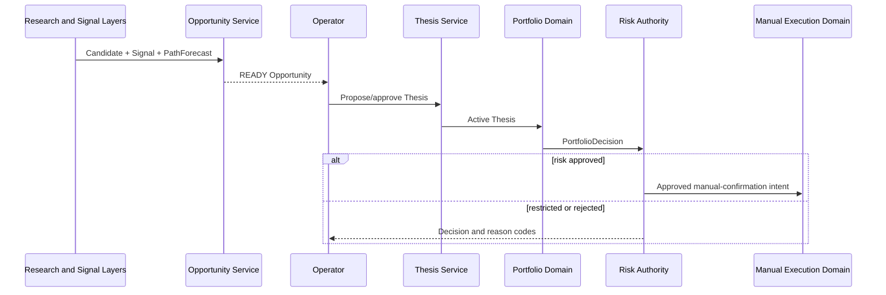

# Trade Decision and Risk Domain

> **Status:** CURRENT_ARCHITECTURE  
> **Authority:** Bounded-context design for opportunity, thesis and hard-risk permission  
> **Owner:** Market Regime Alpha maintainers  
> **Last Updated:** 2026-08-01  
> **Supersedes:** None  
> **Superseded By:** None  
> **Related Documents:** ../01-Domain-Boundaries.md, ../10-Production-Decision-Lifecycle.md, ../../specs/Production-Decision-Lifecycle-Requirements.md, ../../roadmap/work-packages/WP-PDL-Production-Decision-Lifecycle.md  
> **Code Evidence:** Target domain boundary; current `decision/contracts.py` is a thin simulation contract and does not implement the aggregates defined here.

## Responsibility

The Trade Decision and Risk domain owns the transition from verified research evidence into a human-reviewable trading thesis and an independently risk-approved portfolio action.

It does not own:

- raw data or SourceManifest;
- Market, Theme, Capital or Candidate research;
- Signal or Forecast computation;
- actual orders or fills;
- actual Position state;
- model promotion.

## Owned aggregates

### TradingOpportunity

Represents a time-limited opportunity assembled from exact research, signal and forecast evidence.

Required identity and evidence:

- opportunity ID;
- CandidateSet artifact ID;
- SignalSnapshot artifact IDs;
- PathForecast artifact ID;
- symbol and theme scope;
- Decision Time and valid-until time;
- model and configuration identities;
- state, confidence and reason codes;
- optimistic version.

States:

```text
DISCOVERED → READY → TRIGGERED → CONVERTED_TO_THESIS
                 ├→ EXPIRED
                 └→ REJECTED
```

Invariants:

1. All upstream artifacts verify.
2. Symbol and Decision Time scopes align.
3. Expired opportunities cannot be triggered.
4. Data-insufficient signal or forecast cannot produce READY.
5. Equivalent evidence and strategy configuration produce an idempotent identity.

### TradingThesis

Represents the explicit reason for considering or holding exposure.

Required fields:

- thesis ID and opportunity ID;
- strategy ID and symbol;
- rationale;
- supporting evidence references;
- invalidation conditions;
- time invalidation;
- state;
- actor and approval time;
- optimistic version.

States:

```text
PROPOSED → APPROVED → ACTIVE ↔ WEAKENING → INVALIDATED → CLOSED
       └→ REJECTED                 └───────────────→ CLOSED
```

Invariants:

1. A thesis cannot exist without an eligible opportunity.
2. An invalidated thesis cannot authorize ADD.
3. Evidence references are immutable.
4. State transitions append audit events.
5. Human rejection changes thesis state, not upstream research evidence.

### RiskDecision

Represents independent hard-risk permission over a PortfolioDecision.

Required inputs:

- PortfolioDecision identity;
- current PositionSnapshot identities;
- available cash and available quantity;
- Market Regime exposure ceiling;
- per-symbol and per-theme limits;
- liquidity and capacity assumptions;
- T+1 constraints;
- portfolio loss and drawdown budgets;
- exact limit-configuration identity.

Outputs:

- APPROVE;
- RESTRICT;
- REJECT;
- DATA_INSUFFICIENT.

A timeout, unavailable risk dependency or incomplete authoritative Position state fails closed.

## Commands

| Command | Preconditions | Result |
|---|---|---|
| `CreateTradingOpportunity` | verified Candidate, Signal and Forecast evidence | idempotent Opportunity |
| `ExpireTradingOpportunity` | opportunity not terminal | EXPIRED state and audit event |
| `CreateTradingThesis` | READY/TRIGGERED opportunity, operator permission | PROPOSED Thesis |
| `ApproveTradingThesis` | valid evidence and approver | APPROVED Thesis |
| `ActivateTradingThesis` | approved thesis and approved position action | ACTIVE Thesis |
| `WeakenTradingThesis` | new evidence weakens but does not invalidate | WEAKENING Thesis |
| `InvalidateTradingThesis` | an invalidation condition is satisfied | INVALIDATED Thesis |
| `CloseTradingThesis` | position closed or opportunity abandoned | CLOSED Thesis |
| `EvaluateRisk` | complete PortfolioDecision and authoritative position/cash | RiskDecision |
| `PauseStrategy` | risk-approver permission | new exposure blocked |

All command-facing writes require an idempotency key or deterministic identity.

## Queries

- `GetOpportunityDetail`;
- `ListReadyOpportunities`;
- `ListActiveTheses`;
- `GetThesisEvidence`;
- `GetLatestRiskDecision`;
- `GetStrategyPauseState`;
- `GetDecisionAuditTrace`.

Queries return read models and never recompute canonical research or risk decisions.

## Domain events

- `TradingOpportunityCreated`;
- `TradingOpportunityExpired`;
- `TradingOpportunityRejected`;
- `TradingThesisProposed`;
- `TradingThesisApproved`;
- `TradingThesisActivated`;
- `TradingThesisWeakened`;
- `TradingThesisInvalidated`;
- `TradingThesisClosed`;
- `RiskApproved`;
- `RiskRestricted`;
- `RiskRejected`;
- `StrategyPaused`;
- `StrategyResumed`.

Events are append-only audit facts. Before any service extraction, database commit and event publication shall use an outbox or equivalent recoverable mechanism.

## Repository ports

- `TradingOpportunityRepository`;
- `TradingThesisRepository`;
- `RiskDecisionRepository`;
- `StrategyPauseRepository`;
- `AuditEventRepository`.

PostgreSQL 16 is the only durable local database implementation. Repository
contract and migration tests run against isolated PostgreSQL schemas; production
operational admission remains a separate evidence gate.

## Interactions



## Failure behavior

| Failure | Required behavior |
|---|---|
| Artifact verification fails | reject Opportunity creation |
| Evidence scopes disagree | `EVIDENCE_MISMATCH` |
| Opportunity expired | reject thesis conversion |
| Concurrent state update | optimistic `VERSION_CONFLICT` |
| Duplicate command | return original semantic result |
| Risk dependency unavailable | fail closed |
| Position reconciliation unresolved | reject new exposure |
| Strategy paused | reject new opportunity conversion or risk approval |
| Human acts outside approved decision | record execution deviation; do not rewrite RiskDecision |

## Compatibility

- The fixed MR1 recommendation and non-ENTER plumbing under `daily_decision/**` remain unchanged.
- Historical `daily_research` contracts remain compatibility-only.
- New Opportunity, Thesis and Risk schemas receive new identities.
- No Candidate, Signal or Forecast artifact is retroactively interpreted as a trade decision.

## Missing implementation

- contracts and stable IDs;
- repositories and migrations;
- state-transition services;
- audit/outbox events;
- actor and permission enforcement;
- PortfolioDecision integration;
- fail-closed Risk Authority;
- CLI/API application adapters;
- concurrency, recovery and end-to-end tests.
