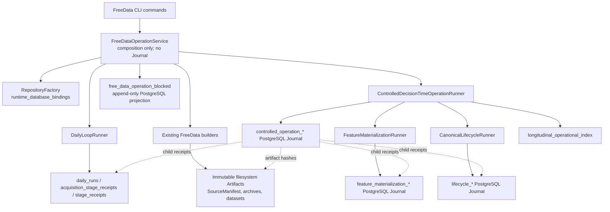

# WP-CRR-01 CRR-00 Baseline and Write Authority

> **Status:** CURRENT_STATUS
> **Authority:** Commit-bound baseline and write-authority audit for WP-CRR-01 CRR-00
> **Owner:** Market Regime Alpha maintainers
> **Last Updated:** 2026-08-06
> **Supersedes:** None
> **Superseded By:** None
> **Related Documents:** ../superpowers/specs/2026-08-06-continuous-research-runtime-design.md, ../superpowers/plans/2026-08-06-wp-crr-01-continuous-research-runtime.md
> **Code Evidence:** `origin/main@8de820cd149278bfebbaf18f150a90f36380176d`; CRR-00 isolated PostgreSQL and quality-gate commands recorded below

Scope is CRR-00 only; this document does not claim CRR-01–CRR-06 completion.

## 1. Isolation and repository identity

| Item | Observed value |
| --- | --- |
| Repository | `git@github.com:yuan2go/market-regime-alpha.git` |
| Remote baseline | `origin/main` at `8de820cd149278bfebbaf18f150a90f36380176d` |
| Baseline tree | `545d450da380615529d6b7c31e3c507a12dd297b` |
| Worktree | `/Users/yuan/projects/market-regime-alpha-worktrees/continuous-research-runtime` |
| Branch | `feat/continuous-research-runtime`, tracking `origin/main` |
| Original workspace | `/Users/yuan/projects/market-regime-alpha` |
| Original workspace state | Preserved; `.idea/modules.xml` remained modified only in the original workspace |

The worktree was created directly from the fetched `origin/main`. No fetch,
switch, stash, reset, clean, or write was performed against the original user
workspace after inspection. The original local branch and its user-owned IDE
change are not inputs to WP-CRR-01.

Recent baseline history:

```text
8de820c Merge pull request #38 from yuan2go/feat/controlled-1455-operational-evidence
f6db365 fix(runtime): bind free data commands to code
483822b fix(data): satisfy source metadata type gate
14137c9 fix(runtime): bind blocked evidence to postgres
612594d fix(runtime): close free data authority gaps
4b648d0 test(runtime): prove free data postgres replay boundaries
583f937 feat(runtime): compose free data canonical operation
a1047de feat(data): materialize free operational inputs
```

## 2. Toolchain and runtime inventory

| Item | Observed value |
| --- | --- |
| Worktree Python | CPython 3.12.2 through `uv` |
| `uv` | 0.11.7 |
| PostgreSQL client/server | 16.14 (Homebrew) |
| SQLite CLI | 3.51.0 |
| Packaging | `uv sync --frozen --extra dev --extra postgres` |
| PostgreSQL driver | `psycopg` optional dependency selected by the `postgres` extra |

Published console scripts on the baseline are limited to the FreeData wrapper:

```text
prepare-free-data-operation
run-free-data-decision-window
resume-free-data-operation
replay-free-data-operation
report-free-data-operation
inspect-free-data-operation
```

Additional module-level CLI entry points exist for Controlled Operation,
Canonical Lifecycle, Feature materialization, and manual-only lifecycle
operations, but they are not declared as independent all-day owners.

The repository contains legacy FastAPI applications under `web/`; they are not
part of WP-CRR-01 and will not be expanded by this work package.

## 3. PostgreSQL test isolation

The host already had PostgreSQL binaries, but no existing database was assumed
safe. CRR-00 therefore used disposable clusters created with `initdb` under a
random `/tmp/mra-crr00-pg.*` directory, bound only to `127.0.0.1` on dedicated
ports. Each cluster used a new database and was stopped and deleted by a shell
trap after its test command.

The test DSN contains a test-only credential so the credential-redaction tests
exercise their intended branch. It is never written to repository files,
artifacts, or this document.

| Check | Result | Evidence |
| --- | --- | --- |
| PostgreSQL-focused suite with isolated cluster | PASS | All tests under `tests/persistence/postgres` passed |
| Previously skipped PostgreSQL cases activated | PASS | All 41 database-dependent cases ran instead of skipping |
| Full suite with credential-free DSN | FAIL (environment construction) | 2 redaction assertions correctly rejected a DSN that had no credential to redact; 2,264 passed |
| Full suite with isolated credential-bearing DSN | PASS | 2,266 passed, 6 warnings, 8 subtests passed in 251.62 seconds |

The first full-suite failure did not justify changing production code or test
assertions. It demonstrated that the disposable test DSN must contain a test
credential for the credential-redaction contract to be meaningful.

## 4. Baseline quality gate

The no-PostgreSQL baseline at the same Git tree had already established:

| Command | Result |
| --- | --- |
| `uv sync --frozen --extra dev --extra postgres` | PASS |
| `uv run python scripts/check_docs_links.py` | PASS |
| `uv run pytest` without the database variable | PASS: 2,225 passed, 41 skipped, 6 warnings, 8 subtests passed |
| `uv run ruff check .` | PASS |
| `uv run mypy` | PASS: 339 source files |
| `uv run python -m build` | PASS |

These results are baseline evidence only. Final CRR acceptance must run the same
gates against the exact implementation HEAD and must include an isolated
PostgreSQL cluster.

The PostgreSQL package contains 43 collected tests; 41 of the full-suite cases
were database-dependent and changed from skipped to executed when the isolated
test database was configured.

## 5. Current implementation facts

### 5.1 Canonical and Controlled operation

The baseline has a recoverable Controlled Operation backed by PostgreSQL. It
prepares immutable calendar, request-scoped universe, daily source, daily
dataset, static feature, operational research, candidate, minute acquisition,
intraday feature overlay, Signal, PathForecast, Entry Assessment, operation
package, and outcome/index stages. Its stage Journal supports:

- idempotent run creation;
- worker Claim and expiring Lease;
- monotonically increasing claim epoch as a fencing token;
- optimistic version checks;
- append-only attempts, receipts, child references, and events;
- resume after a failed or expired attempt.

The Canonical Lifecycle remains Entry fail-closed. Its default PathForecast
path is not production-qualified, and its Entry Assessment cannot authorize an
entry. WP-CRR-01 must not make Opportunity, Order, BrokerOrder, real Fill, or
Position mutation reachable.

### 5.2 FreeData wrapper

`FreeDataOperationService` is currently a composition service, not an
independent Journal owner. It:

1. binds a FreeData operation and a Daily run to the configured PostgreSQL
   database;
2. freezes sources through the existing Daily Loop;
3. calls existing FreeData builders to produce immutable inputs;
4. publishes fail-closed blocked evidence when formal authority is absent;
5. prepares the existing exact-14:55 Controlled Operation; and
6. delegates the decision-window run to the existing Controlled runner.

Its source explicitly states that it has no Journal of its own. That is correct
for the baseline but insufficient for an all-day continuous owner.

### 5.3 Time semantics

The current `DecisionTimeOperationPolicy` is content-addressed and retains an
exact decision time of 14:55 plus static-ready, minute-fetch, and hard-cutoff
times. It is embedded in historical target, TargetId, replay, and Reader
contracts. WP-CRR-01 will add a separate continuous decision-window policy; it
will not mutate this existing policy or any historical fixed-reference
semantics.

### 5.4 Evidence ceiling

The public data chain is engineering and exploratory evidence. Request symbol
scope is not a complete PIT A-share universe. Tencent/BaoStock/other free data
does not establish formal historical availability, ST, suspension, theme/ETF
membership, corporate-action, or broker orderability authority. A healthy
runtime does not raise this ceiling.

## 6. Current write authority graph



Write ownership at the baseline:

| Concern | Current authority | Persistence | CRR action |
| --- | --- | --- | --- |
| Runtime database identity | `RepositoryFactory` binding | PostgreSQL `runtime_database_bindings` | Reuse and add `CONTINUOUS_RESEARCH` scope |
| Daily acquisition receipts | `DailyLoopRunner` | PostgreSQL daily Journal | Reuse as child; do not duplicate |
| Raw/replay/source Artifacts | Existing provider/archive publishers | Immutable filesystem Artifact | Reuse; wrap with Provider Attempt/Evidence Commit lineage |
| Dataset construction | Existing FreeData/Controlled builders | Immutable filesystem Artifact plus receipts | Reuse only after material change |
| Feature materialization | Existing Feature runner | PostgreSQL Journal plus immutable Artifact | Reuse as child; no duplicate feature engine |
| Candidate/Signal/Forecast/Entry | Existing Controlled/Canonical services | Controlled/Canonical Journals and Artifacts | Reuse; Entry remains blocked |
| All-day polling and change decisions | None | None | New CRR PostgreSQL Journal is the sole owner |
| Last valid research-consumable Evidence | None as an explicit CAS pointer | None | New CRR Evidence Commit and current pointer |

## 7. Baseline database schema

Migrations `001` through `019` are contiguous. Runtime-related authority
already includes:

- `lifecycle_runs`, `lifecycle_stages`, `lifecycle_attempts`,
  `lifecycle_stage_receipts`, `lifecycle_events`;
- `feature_materialization_run`, `feature_materialization_task`,
  `feature_materialization_attempt`, `feature_materialization_receipt`,
  `feature_materialization_event`;
- `controlled_operation_run`, `controlled_operation_stage`,
  `controlled_operation_attempt`, `controlled_operation_receipt`,
  `controlled_operation_child_run`, `controlled_operation_event`;
- `daily_runs`, `acquisition_stage_receipts`, `stage_receipts`;
- `longitudinal_operational_index`;
- `runtime_database_bindings`; and
- `free_data_operation_blocked`.

The existing Controlled and Feature migrations are the reference implementation
for Claim, Lease, fencing epoch, terminal immutability, receipts, and event
history. CRR must not weaken those semantics or create a second connection
authority.

A fresh disposable PostgreSQL 16.14 database verified the migration baseline:

```text
migration_count=19
latest_migration=19
authority_table_count=59
postgres_schema=market_regime_alpha
apply_all=PASS
verify_only=PASS
```

The application schema must exist before the current migration CLI runs. A DSN
without that schema leaves `current_schema()` at `pg_catalog`, where PostgreSQL
correctly denies application table creation. CRR setup and tests therefore
create an explicit isolated `market_regime_alpha` schema; they never fall back
to a host's unknown default database/schema.

## 8. CRR-00 acceptance and non-claims

CRR-00 is accepted only when:

- the isolated worktree remains clean except for intentional CRR files;
- the original workspace remains unchanged;
- all 41 PostgreSQL-dependent cases pass on a disposable cluster;
- the full baseline suite passes with that isolated cluster;
- migrations apply and verify on a fresh isolated database;
- this authority graph is reviewed against current code.

All CRR-00 acceptance items above passed on 2026-08-06 at the baseline commit.

CRR-00 does not establish formal PIT data, economic Alpha, provider
qualification, trading authority, Shadow readiness, or production operations.
