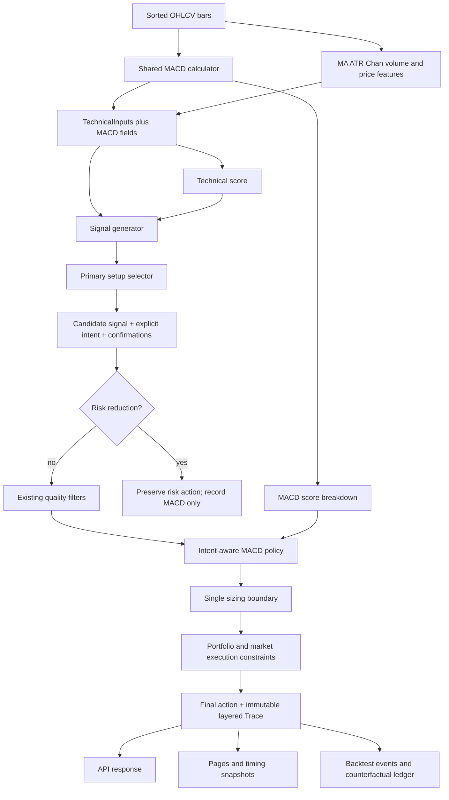

# MACD SignalIntent Integration Design

Date: 2026-07-13

Status: Frozen for final specification review; production implementation is not yet authorized.

Scope: Dividend T technical scoring, simplified strategy, COSCO 5-minute timing engine, snapshots, API, and offline backtests.

## 1. Objective

Add a configurable MACD feature to the current model without treating every golden cross or death cross as a universal trading veto.

The design must:

- calculate reproducible MACD values with explicit warm-up behavior;
- expose a bullish-strength score from 0 to 100 and its diagnostic components;
- add MACD to the technical score as an experimental weight;
- assign every candidate signal an explicit trading intent at signal-generation time;
- apply asymmetric MACD policy based on that intent;
- preserve hard risk exits and base accumulation behavior;
- retain candidate and sizing traces for counterfactual evaluation;
- version every rule that can change cached results;
- support four independent ablation arms and leakage-safe out-of-sample validation;
- preserve legacy behavior whenever MACD data is not ready or the baseline policy profile is active.

This document does not authorize a broad production-code change. Implementation must follow the staged plan and stop at each review and rollback point.

## 2. Current-System Findings

The repository has two related decision paths:

1. `TechnicalInputs -> technical_score -> DividendTStrategy` produces `BUY_T`, `SELL_T`, `HOLD`, `BUILD_BASE`, `REDUCE`, `STOP_T`, and `CLEAR`.
2. `CoscoTimingEngine -> _manual_action -> BacktestSignal -> backtest execution` produces detailed 5-minute actions such as `BUY_T_TIMING`, `SELL_T_TIMING`, `BREAKOUT_BUY_TIMING`, and wait/risk states.

Both paths contain mixed trading semantics:

- support and pullback entries are mean-reversion T trades;
- third-buy, strong-launch, and breakout entries are trend-following trades;
- pressure-area sells can sell an existing T position or initiate a reverse-T sale;
- Chan sell points, structure breaks, `CLEAR`, `REDUCE`, and `STOP_T` are risk reduction;
- `BUILD_BASE` is a separate base-accumulation action.

The existing `chan.py` already computes a 12/26/9 histogram internally for stroke-divergence analysis. That calculation is local to the Chan pipeline and is not a first-class `TechnicalInputs` feature, score component, versioned API field, or intent-aware policy input.

Therefore MACD cannot infer trading intent from final action names. Intent must be fixed when the primary setup is selected.

## 3. Design Principles and Invariants

1. Signal generation owns setup competition and intent assignment.
2. One primary setup code maps to exactly one `SignalIntent` for a given mapping version.
3. The MACD policy consumes candidate fields; it never re-infers intent from booleans, reasons, UI text, or action names.
4. Actual risk reduction is never blocked or reduced by MACD.
5. Base accumulation is recorded but not gated in v1.
6. Mean-reversion sizing is adjusted once, at one designated sizing boundary per pipeline.
7. Unknown intent is visible and safe; it is never silently coerced into a known intent.
8. Internal calculations use full-precision values. Display rounding cannot affect score, cross, zero-axis, intent, or gating decisions.
9. The first ready MACD bar exposes current values only. Adjacent-bar features start on the second ready bar.
10. Cache identity includes every configuration or mapping version that can affect results.
11. A 15% MACD technical-score weight and trend-buy block rule are research hypotheses, not proven trading laws.

## 4. MACD Data Contract v1

### 4.1 Enumerations

```python
class MACDCross(str, Enum):
    BULLISH = "BULLISH"
    BEARISH = "BEARISH"
    NONE = "NONE"


class MACDZeroAxis(str, Enum):
    ABOVE = "ABOVE"
    BELOW = "BELOW"
    STRADDLING = "STRADDLING"


class MACDHistogramTrend(str, Enum):
    EXPANDING = "EXPANDING"
    CONTRACTING = "CONTRACTING"
    FLAT = "FLAT"


class MACDDataReason(str, Enum):
    READY = "READY"
    INSUFFICIENT_BARS = "INSUFFICIENT_BARS"
    INVALID_CLOSE = "INVALID_CLOSE"
    EXPECTED_BAR_MISSING = "EXPECTED_BAR_MISSING"
    PRICE_ADJUSTMENT_UNAVAILABLE = "PRICE_ADJUSTMENT_UNAVAILABLE"


class BarInterval(str, Enum):
    DAY_1 = "1d"
    MINUTE_5 = "5m"


class MACDPriceField(str, Enum):
    CLOSE = "close"


class PriceAdjustmentMode(str, Enum):
    POINT_IN_TIME_ADJUSTED = "POINT_IN_TIME_ADJUSTED"


class HistogramToleranceMode(str, Enum):
    ABSOLUTE = "ABSOLUTE"
```

### 4.2 `MACDConfig`

```python
@dataclass(frozen=True)
class MACDConfig:
    bar_interval: BarInterval
    fast_period: int = 12
    slow_period: int = 26
    signal_period: int = 9
    cross_lookback_bars: int = 3
    closed_bars_only: bool = True
    price_field: MACDPriceField = MACDPriceField.CLOSE
    price_adjustment_mode: PriceAdjustmentMode = PriceAdjustmentMode.POINT_IN_TIME_ADJUSTED
    histogram_tolerance_mode: HistogramToleranceMode = HistogramToleranceMode.ABSOLUTE
    histogram_flat_tolerance: float = 0.0
    algorithm_version: str = "macd-v1"
```

Validation rules:

- `fast_period`, `slow_period`, `signal_period`, and `cross_lookback_bars` must be integers and must explicitly reject `bool`;
- periods must be positive;
- `fast_period < slow_period`;
- `cross_lookback_bars >= 1`;
- `bar_interval` must be `1d` or `5m` in v1 and is required rather than inferred from row spacing;
- `closed_bars_only` must be an actual boolean and must be `True` for formal scoring, policy, snapshots, and backtests;
- `price_field` must be `close` in v1;
- `price_adjustment_mode` must be `POINT_IN_TIME_ADJUSTED` in v1;
- `histogram_tolerance_mode` must be `ABSOLUTE` in v1;
- `histogram_flat_tolerance >= 0` and finite;
- `algorithm_version` must be non-empty after trimming.

Invalid configuration raises a dedicated configuration exception. It must not be converted into `INSUFFICIENT_BARS`.

`histogram_flat_tolerance` is an absolute tolerance in the same price unit as the MACD histogram. In v1 it applies only to adjacent histogram absolute-value comparisons. A value of `0.0` means strict comparison. Relative and ATR-normalized modes are outside v1.

Tolerance is scoped to one effective MACD configuration for one bar interval and symbol/config resolver result. A non-zero absolute tolerance must not become an implicit global default across symbols with materially different price scales. Effective mode and tolerance are recorded per pipeline and row. Daily and 5-minute pipelines may use different effective configurations even when both use 12/26/9.

### 4.3 Flat additions to `TechnicalInputs`

```text
macd_dif: float | None = None
macd_dea: float | None = None
macd_histogram: float | None = None
macd_histogram_delta: float | None = None

macd_histogram_trend: MACDHistogramTrend = FLAT
macd_cross: MACDCross = NONE
macd_cross_age: int | None = None
macd_zero_axis: MACDZeroAxis = STRADDLING

macd_data_ready: bool = False
macd_data_reason: MACDDataReason = INSUFFICIENT_BARS
macd_score: float = 50.0
```

Every result also carries calculation metadata:

```text
bar_interval
closed_bars_only
price_field
price_adjustment_mode
histogram_tolerance_mode
provisional
last_closed_bar_time
bar_contract_version
price_adjustment_version
data_quality_rule_version
```

`provisional=False` is mandatory for any result used by formal score, signal policy, snapshot publication, or backtest execution. A UI-only preview may set `provisional=True`, but it must travel through a distinct preview response and must never be converted into `TechnicalInputs` used for decisions.

Raw numeric fields use `None` when not calculated or unavailable. They must never use `0.0` as a missing-value sentinel.

### 4.4 Consistency validation

When `macd_data_ready=True`:

- `macd_data_reason == READY`;
- DIF, DEA, and Histogram are non-null and finite;
- `0 <= macd_score <= 100`;
- if `macd_cross != NONE`, `macd_cross_age` is non-null and satisfies `0 <= age < cross_lookback_bars`;
- if `macd_cross == NONE`, `macd_cross_age is None`.

When `macd_data_ready=False`:

- `macd_data_reason != READY`;
- all raw numeric fields are `None`;
- `macd_histogram_trend == FLAT`;
- `macd_cross == NONE`;
- `macd_cross_age is None`;
- `macd_zero_axis == STRADDLING`;
- `macd_score == 50.0`.

The first ready bar is a valid exception only for `macd_histogram_delta`, which remains `None` while the other ready-state invariants hold.

## 5. MACD Calculation Rules v1

### 5.1 Bar-time, price, calendar, and quality contract

Formal MACD uses completed bars only. `closed_bars_only=True` is invariant for scoring, candidate generation, policy, and backtesting.

Bar-close rules:

- a 5-minute bar timestamp is its interval end; the first continuous-auction bar ends at 09:35 and the final bar ends at 15:00;
- only bars whose interval end is at or before the evaluation time and whose source status is finalized are eligible;
- the 09:15-09:25 opening call auction is excluded from v1 MACD unless a future separately versioned adapter standardizes it;
- the lunch break contains no bars; no 11:35-12:55 placeholders are inserted;
- the overnight interval contains no bars;
- the final 14:55-15:00 bar becomes eligible only after its 15:00 close is finalized;
- a daily bar becomes eligible only after the official daily close is finalized.

An unfinished 5-minute or daily bar may be calculated for UI preview only. Preview metadata must set `provisional=True`; preview values cannot enter `TechnicalInputs`, `T_score`, SignalIntent policy, published formal snapshots, caches used by formal backtests, or orders.

Backtest timing rules:

- signal time equals or follows the close timestamp of the newest input bar;
- the earliest executable price is from the next eligible bar after signal time;
- no open, high, low, close, or volume that occurred before the signal bar closed may be reused as a post-signal fill;
- same-bar signal-and-fill behavior is forbidden and covered by a regression test.

Trading-calendar and gap rules:

- exchange holidays and verified suspension days produce no synthetic bars;
- normal non-trading sessions, lunch, and overnight periods produce no forward-filled bars;
- a missing 5-minute bar is never filled with the previous close;
- EMA advances only over actual, valid, finalized trading bars;
- if the calendar, suspension state, and source contract say a bar should exist but it is absent, formal MACD returns `EXPECTED_BAR_MISSING` and records the missing interval in data-quality diagnostics;
- if absence is explained by a holiday or verified suspension, it is not a data gap and EMA continues on the next actual trading bar.

Price contract:

- `price_field=close` identifies the source field before the configured adjustment transform;
- formal daily and 5-minute historical MACD use `POINT_IN_TIME_ADJUSTED` prices built only from corporate actions effective and knowable at the evaluation time;
- execution, slippage, commission, stamp duty, price-limit, and PnL calculations continue to use contemporaneous raw tradable prices;
- live 5-minute bars use raw exchange prices for the current corporate-action basis, while earlier history is rebased to that same basis using only already-effective dividend, split, bonus-share, or ETF-distribution events;
- backtest and live feature preparation use the same adjustment adapter and configuration;
- future corporate actions must not alter an earlier point-in-time feature snapshot;
- if an adjustment event needed to make the series continuous is unavailable, formal MACD returns `PRICE_ADJUSTMENT_UNAVAILABLE` rather than allowing an ex-right or distribution jump to create a false cross.

The calculation input therefore consists of one explicitly versioned interval, one finalized-bar series, and one point-in-time price basis. Daily and 5-minute results with identical numeric parameters remain distinct features because `bar_interval`, bar-close semantics, and effective price basis are part of the result identity.

### 5.2 Input validation

Every close in the complete input sequence participates in the validity check. Every value must be convertible to a finite positive float.

Any `None`, `NaN`, positive or negative infinity, non-numeric value, zero, or negative close makes the entire result `INVALID_CLOSE`. The implementation must not inspect only the latest warm-up window because the current EMA depends on all earlier recursive values.

### 5.3 EMA definition

The normative definition is:

```text
alpha = 2 / (period + 1)
EMA_0 = close_0
EMA_t = alpha * close_t + (1 - alpha) * EMA_t-1
```

A pandas implementation must use `ewm(span=period, adjust=False)`. The recursive definition, rather than a library's undocumented default behavior, governs compatibility with future pandas, NumPy, TA-Lib, or other calculation engines.

### 5.4 MACD values

```text
EMA_fast = EMA(close, fast_period)
EMA_slow = EMA(close, slow_period)
DIF = EMA_fast - EMA_slow
DEA = EMA(DIF, signal_period)
Histogram = 2 * (DIF - DEA)
HistogramDelta = Histogram_t - Histogram_t-1
```

All state and score calculations use unrounded values.

### 5.5 Warm-up boundary

```text
minimum_required_bars = slow_period + signal_period - 1
```

With 12/26/9, the minimum is 34 bars.

At 33 bars:

- data is not ready;
- reason is `INSUFFICIENT_BARS`;
- all raw numeric fields are `None`;
- score is 50.

At the 34th bar, the first ready bar:

- DIF, DEA, and Histogram are exposed;
- ZeroAxis is calculated;
- HistogramDelta is `None`;
- HistogramTrend is `FLAT`;
- Cross is `NONE` and CrossAge is `None`;
- score uses only histogram-sign and zero-axis components;
- cross and histogram-trend score components are zero.

Starting at the 35th bar:

- HistogramDelta and HistogramTrend may be calculated;
- a cross may be formed only from two consecutive ready bars;
- no crossing between a pre-ready bar and the first ready bar is recognized;
- no pre-warm-up cross is backfilled.

### 5.6 Histogram trend

HistogramDelta remains signed. HistogramTrend describes absolute bar-size change only:

```text
EXPANDING:
abs(hist_t) > abs(hist_t-1) + tolerance

CONTRACTING:
abs(hist_t) < abs(hist_t-1) - tolerance

FLAT:
otherwise
```

The bullish or bearish direction is determined separately by whether the current histogram is positive or negative. A negative expanding bar must not be described as bullish expansion.

### 5.7 Zero axis

```text
ABOVE: DIF > 0 and DEA > 0
BELOW: DIF < 0 and DEA < 0
STRADDLING: all other cases, including either value exactly equal to zero
```

v1 uses strict raw-value comparison and no tolerance for ZeroAxis.

### 5.8 True-cross detection and age

A true cross occurs only when the ordering changes:

```text
BULLISH:
DIF_t > DEA_t and DIF_t-1 <= DEA_t-1

BEARISH:
DIF_t < DEA_t and DIF_t-1 >= DEA_t-1
```

Continuous `DIF > DEA` is not a new bullish cross. Continuous `DIF < DEA` is not a new bearish cross.

The scanner searches the current bar and the previous `cross_lookback_bars - 1` bars for the most recent true cross. With a lookback of three:

- age 0 is a cross on the current bar;
- age 1 is a cross on the previous bar;
- age 2 is a cross two bars ago.

The following invariants apply:

- `macd_cross_age` identifies the bar that actually satisfied the cross formula;
- age increases by one on every later bar if no newer true cross occurs;
- the state is not refreshed to age 0 merely because the same ordering persists;
- if opposite-direction crosses occur in the window, only the most recent true cross is returned;
- after the true cross ages outside the window, the result becomes `NONE/None`.

## 6. MACD Bullish-Strength Score v1

`macd_score` always represents bullish strength from 0 to 100. It is not a direction-neutral confidence score.

```text
base                                             50

Histogram > 0                                   +15
Histogram < 0                                   -15
Histogram == 0                                    0

ZeroAxis ABOVE                                  +15
ZeroAxis BELOW                                  -15
ZeroAxis STRADDLING                               0

recent BULLISH cross                            +cross_bonus
recent BEARISH cross                            -cross_bonus

positive EXPANDING or negative CONTRACTING       +5
negative EXPANDING or positive CONTRACTING       -5
FLAT                                               0
```

```text
cross_bonus = 15 * (cross_lookback_bars - age) / cross_lookback_bars
macd_score = clamp(raw_score, 0, 100)
```

For a three-bar window, age 0/1/2 contributes 15/10/5 points.

Except for HistogramTrend's configured absolute tolerance, v1 uses strict comparisons on unrounded values.

### 6.1 Diagnostic score contract

The calculation layer returns an internal immutable `MACDScoreBreakdown` containing:

```text
histogram_sign_component
zero_axis_component
cross_component
histogram_trend_component
raw_macd_score
clamped_macd_score
```

These fields need not be flattened into `TechnicalInputs`, but they must be available to API debug output, snapshots used for research, backtest signals, and event logs.

When data is unavailable, all four components are zero and both raw and clamped score are 50.

## 7. Shared MACD Module Boundary

Create one shared MACD module that owns:

- configuration validation;
- recursive EMA-compatible series calculation;
- warm-up state;
- true-cross scanning;
- zero-axis and histogram-trend classification;
- bullish-strength scoring and diagnostics;
- contract and algorithm version metadata.

`indicators.py` uses the shared result to populate flat `TechnicalInputs` fields.

`chan.py` may reuse the shared low-level EMA/MACD-series primitive on the Chan-normalized frame, but the migration must preserve current Chan semantics and golden results. The main technical MACD is calculated on the normal sorted input frame; the Chan divergence MACD continues to operate on its inclusion-normalized frame. These are intentionally different input series and must not be conflated.

## 8. Explicit Candidate Signal Contract

### 8.1 Enumerations

```python
class SignalIntent(str, Enum):
    NONE = "NONE"
    MEAN_REVERSION_T = "MEAN_REVERSION_T"
    TREND_FOLLOWING = "TREND_FOLLOWING"
    RISK_REDUCTION = "RISK_REDUCTION"
    BASE_ACCUMULATION = "BASE_ACCUMULATION"
```

`SignalIntent.NONE` is allowed only when:

- no candidate trading signal exists;
- reading a legacy API response or snapshot without intent;
- an old historical record cannot be classified.

Every newly generated `BUY_T`, `SELL_T`, `CLEAR`, `REDUCE`, `STOP_T`, or `BUILD_BASE` candidate must have a non-`NONE` intent.

If a candidate exists but its intent is unknown:

- Trace records `UNKNOWN_SIGNAL_INTENT`;
- strict mode raises a candidate-contract exception;
- compatibility mode skips MACD policy and preserves the pre-MACD candidate;
- compatibility mode must not default the candidate to mean reversion or trend following.

### 8.2 Candidate fields

Every signal-generation entry point emits one candidate object with:

```text
candidate_signal
candidate_signal_intent
candidate_setup_code
primary_setup_code
entry_confirmations
exit_confirmations
candidate_reasons
```

`candidate_setup_code` and `primary_setup_code` are equal in v1. Both names are retained in Trace so future candidate-ranking diagnostics can list secondary setups without changing the meaning of the primary setup.

The MACD policy consumes these fields. It does not inspect legacy reasons or redo setup competition.

## 9. Primary Setup Selection and Intent Mapping

### 9.1 Stable mapping

The mapping is versioned as `signal-intent-map-v1`.

| Primary setup code | SignalIntent |
| --- | --- |
| `pullback_low_buy` | `MEAN_REVERSION_T` |
| `vwap_reclaim` | `MEAN_REVERSION_T` |
| `intraday_reversal` | `MEAN_REVERSION_T` |
| `range_low_buy` | `MEAN_REVERSION_T` |
| `pressure_sell_t` | `MEAN_REVERSION_T` |
| `reverse_t_sell` | `MEAN_REVERSION_T` |
| `force_reversal_probe` | `MEAN_REVERSION_T` |
| `trend_follow` | `TREND_FOLLOWING` |
| `trend_pullback_follow` | `TREND_FOLLOWING` |
| `breakout_confirmed` | `TREND_FOLLOWING` |
| `third_buy_follow` | `TREND_FOLLOWING` |
| `strong_launch_follow` | `TREND_FOLLOWING` |
| `attention_feedback_follow` | `TREND_FOLLOWING` |
| `clear` | `RISK_REDUCTION` |
| `reduce` | `RISK_REDUCTION` |
| `stop_t` | `RISK_REDUCTION` |
| `third_sell` | `RISK_REDUCTION` |
| `structure_break` | `RISK_REDUCTION` |
| `chan_sell_risk` | `RISK_REDUCTION` |
| `top_divergence_risk` | `RISK_REDUCTION` |
| `build_base` | `BASE_ACCUMULATION` |

### 9.2 Setup competition

Setup competition belongs to each signal generator and must be deterministic.

For the simplified strategy, candidate selection preserves hard-risk priority, then selects the primary buy/sell setup:

1. `clear`, `reduce`, `stop_t`, `third_sell`, or `structure_break` according to current risk priority;
2. explicit `third_buy_follow` or `breakout_confirmed` when that setup is the primary reason for entry;
3. `intraday_reversal`, `pullback_low_buy`, `vwap_reclaim`, or other mean-reversion setup;
4. `pressure_sell_t`;
5. `build_base`;
6. no candidate.

A pullback boolean does not automatically change a strong-trend or third-buy primary setup into mean reversion. The generator selects the primary setup from the branch that actually wins candidate selection.

For the detailed 5-minute engine, the existing ordered action branches remain the source of primary-setup selection. Each branch returns a structured candidate with a setup code and mapped intent rather than a plain `(action, reasons, warnings)` tuple. Later quality, freshness, MACD, and execution layers may transform the final action but cannot replace the original primary setup.

`reverse_t_sell` needs position context that the advisory timing engine does not always possess. A pressure-area candidate generated without holdings therefore remains `primary_setup_code=pressure_sell_t`. If the execution layer later finds no T shares and opens a reverse-T pending-buyback position, it records `execution_setup_code=reverse_t_sell` without rewriting the candidate's primary setup or intent. Both codes map to `MEAN_REVERSION_T`.

## 10. Standardized Confirmations

### 10.1 Enumerations

```python
class EntryConfirmation(str, Enum):
    NONE = "NONE"
    INTRADAY_REVERSAL = "INTRADAY_REVERSAL"
    CHAN_BUY_POINT = "CHAN_BUY_POINT"
    SUPPORT_HOLD = "SUPPORT_HOLD"
    VWAP_RECLAIM = "VWAP_RECLAIM"
    SELLING_PRESSURE_EXHAUSTION = "SELLING_PRESSURE_EXHAUSTION"


class ExitConfirmation(str, Enum):
    NONE = "NONE"
    VOLUME_STALLING = "VOLUME_STALLING"
    RESISTANCE_REJECTION = "RESISTANCE_REJECTION"
    CHAN_SELL_POINT = "CHAN_SELL_POINT"
    TOP_DIVERGENCE = "TOP_DIVERGENCE"
    MOMENTUM_EXHAUSTION = "MOMENTUM_EXHAUSTION"
```

Candidate objects store `frozenset[EntryConfirmation]` and `frozenset[ExitConfirmation]`. API and JSON serialization use deterministically sorted lists of enum values.

An empty confirmation state is represented as `{NONE}` at the contract boundary and serialized as `["NONE"]`. `NONE` must never coexist with a real confirmation in the same set. Internal policy helpers may normalize `{NONE}` to an empty set before intersection checks.

The confirmation rules are versioned as `confirmation-rules-v1`.

v1 uses the current-bar-only validity model. Confirmation sets describe conditions that the signal generator recomputed and found valid on the current finalized decision bar. They do not persist across bars and carry no implicit lookback age. Every new decision bar rebuilds both sets from source features; copying a prior candidate's confirmations is a contract violation.

This deliberately chooses the simpler confirmation-expiry scheme:

- a confirmation that was true two bars ago but is false now is absent now;
- candidate and confirmation source time must equal the current decision bar time;
- quality and MACD policy layers consume the immutable current-bar sets;
- tests must prove a prior support hold, reversal, VWAP reclaim, resistance rejection, or stall cannot authorize a later candidate after it expires.

### 10.2 Rule ownership

Signal generation converts source-specific observations into standardized confirmations exactly once. Examples:

- a real intraday reclaim/reversal adds `INTRADAY_REVERSAL`;
- a recognized Chan buy point adds `CHAN_BUY_POINT`;
- holding or reclaiming a calculated support level adds `SUPPORT_HOLD`; merely being near support does not;
- reclaiming VWAP adds `VWAP_RECLAIM`;
- evidence that selling pressure has exhausted adds `SELLING_PRESSURE_EXHAUSTION`;
- high-volume stalling adds `VOLUME_STALLING`;
- rejection from a calculated resistance region adds `RESISTANCE_REJECTION`;
- a Chan sell point adds `CHAN_SELL_POINT`;
- top divergence adds `TOP_DIVERGENCE`;
- a defined momentum-exhaustion setup adds `MOMENTUM_EXHAUSTION`.

The MACD policy checks only these stable sets. It must not inspect UI copy, reason strings, or duplicate the source-specific confirmation formulas.

## 11. MACD Policy Configuration

The policy is versioned as `signal-intent-macd-v1`.

```python
@dataclass(frozen=True)
class MACDPolicyConfig:
    score_weight: float
    conflict_gate_enabled: bool
    mean_reversion_size_multiplier: float = 0.5
    minimum_executable_trade_pct: float = 0.0
    trend_buy_block_bearish_cross: bool = True
    trend_buy_block_zero_axis_states: frozenset[MACDZeroAxis] = frozenset(
        {MACDZeroAxis.BELOW, MACDZeroAxis.STRADDLING}
    )
    mean_reversion_buy_accepted_confirmations: frozenset[EntryConfirmation] = frozenset(
        {
            EntryConfirmation.INTRADAY_REVERSAL,
            EntryConfirmation.CHAN_BUY_POINT,
            EntryConfirmation.SUPPORT_HOLD,
            EntryConfirmation.VWAP_RECLAIM,
        }
    )
    mean_reversion_sell_accepted_confirmations: frozenset[ExitConfirmation] = frozenset(
        {
            ExitConfirmation.VOLUME_STALLING,
            ExitConfirmation.RESISTANCE_REJECTION,
            ExitConfirmation.CHAN_SELL_POINT,
            ExitConfirmation.TOP_DIVERGENCE,
        }
    )
    policy_version: str = "signal-intent-macd-v1"
```

Validation rules:

- `0 <= score_weight <= 1` and finite;
- `0 <= mean_reversion_size_multiplier <= 1` and finite;
- `0 <= minimum_executable_trade_pct <= 1` and finite;
- booleans must be actual booleans;
- the zero-axis set contains only `MACDZeroAxis` values;
- the accepted buy set contains only non-`NONE` `EntryConfirmation` values;
- the accepted sell set contains only non-`NONE` `ExitConfirmation` values;
- neither accepted set may be empty in the v1 experimental profile;
- `policy_version` is non-empty.

The accepted sets are explicit experiment configuration, not a hard-coded rule accepting every non-`NONE` confirmation. Their canonical sorted values enter the experiment hash and cache identity. The effective `confirmation_rule_version` is the base rule version plus a short hash of the current-bar rule and both accepted sets, so a set change cannot retain the same effective confirmation version accidentally.

The runtime exposes two named profiles rather than silently changing production behavior:

```text
baseline:
score_weight=0
conflict_gate_enabled=False

experimental_full:
score_weight=0.15
conflict_gate_enabled=True
```

The 15% weight and trend-buy conflict rule are explicit model hypotheses pending ablation and out-of-sample validation. Production runtime remains on the baseline profile until a separate promotion decision is reviewed.

## 12. Technical-Score Integration

Every component entering `T_score` is normalized to the closed interval `[0, 100]` at the scoring boundary:

```text
position_quality
volume_structure
trend_quality
intraday_support
chan_score
macd_score
```

Feature modules remain responsible for meaningful domain scaling. The scoring boundary rejects non-finite values and applies the documented 0-to-100 clamp before weighting; it never combines raw ratios, prices, or unbounded oscillator values directly. When every enabled component equals 50, `T_score` equals 50.

When `macd_data_ready=True` and `score_weight > 0`, existing technical-score weights are scaled proportionally by `1 - score_weight`, then MACD receives `score_weight`.

At the 15% experimental baseline:

```text
position_quality   23.80%
volume_structure   17.00%
trend_quality      14.45%
intraday_support   12.75%
chan_score         17.00%
macd_score         15.00%
```

The final weights must sum to 1 within a documented floating-point tolerance.

When MACD is not ready:

- MACD is excluded;
- original weights are restored exactly;
- neutral score 50 is not mixed into `T_score`;
- final score, candidate signal, suggested size, order intent, reasons, and warnings remain equal to legacy output.

`score_weight` and `conflict_gate_enabled` are independent, enabling score-only, gate-only, full, and baseline experiments.

### 12.1 Dual-use diagnostics

MACD intentionally participates twice: first through `T_score`, then through SignalIntent policy. Research and backtest diagnostics must separate those effects.

For every evaluation point, research mode records:

```text
technical_score_without_macd
technical_score_with_macd
candidate_without_macd_score
candidate_with_macd_score
macd_score_changed_candidate
macd_policy_changed_candidate
```

Definitions:

- `technical_score_without_macd` uses the exact legacy weights and non-MACD inputs;
- `technical_score_with_macd` uses the effective MACD score weight when data is ready;
- `candidate_without_macd_score` is generated from the legacy technical score with the same point-in-time non-MACD inputs and before MACD policy;
- `candidate_with_macd_score` is generated from the MACD-weighted score and before MACD policy;
- `macd_score_changed_candidate` compares those two pre-policy candidates;
- `macd_policy_changed_candidate` compares the weighted pre-policy candidate with the final post-policy candidate or size.

The research evaluator may run the pure candidate selector twice to obtain these counterfactuals. Production Trace may retain only the two booleans and score pair if storage is constrained, but offline event files retain all six fields.

Reports classify each event into mutually inspectable groups:

- candidate absent because MACD score changed the score threshold;
- candidate generated but downgraded by MACD policy;
- candidate generated but resized by MACD policy;
- candidate affected by both score and policy;
- candidate unaffected by either layer.

## 13. Intent-Aware Asymmetric MACD Policy

### 13.1 Policy ordering

The decision order is:

```text
signal generation + primary setup + intent + confirmations
-> hard risk priority
-> existing candidate-quality filters
-> MACD intent policy
-> freshness and execution hard constraints
-> final action/order
```

Hard risk exits may bypass candidate-quality and MACD transformations. MACD diagnostics are still recorded for research.

### 13.2 Trend-following buy hypothesis

For a `TREND_FOLLOWING` buy candidate, v1 defines a conflict only when:

```text
trend_buy_block_bearish_cross is True
and macd_cross == BEARISH
and macd_zero_axis in trend_buy_block_zero_axis_states
```

With the v1 experimental profile, the configured states are `BELOW` and `STRADDLING`. The result is `HOLD`, no order, and a complete downgrade Trace.

A bearish cross while both DIF and DEA remain `ABOVE` contributes to the score but does not hard-block the trend buy.

This is an unproven model hypothesis and must be tested out of sample. The conditions live in `MACDPolicyConfig`; they must not be hard-coded independently in strategy files.

### 13.3 Mean-reversion buy

A bearish cross is not automatically a conflict. It becomes a strong opposing-momentum condition only when:

```text
macd_cross == BEARISH
and macd_zero_axis in {BELOW, STRADDLING}
and macd_histogram < 0
and macd_histogram_trend == EXPANDING
```

The policy then checks standardized entry confirmations.

- If no accepted entry confirmation is present, the candidate is downgraded to `HOLD` with source `MACD_CONFIRMATION_REQUIRED`.
- If at least one accepted entry confirmation is present, the candidate remains a buy and its original suggested active-trade percentage is multiplied once by `mean_reversion_size_multiplier`.
- If the strong opposing-momentum condition is absent, MACD does not alter the candidate size; `macd_score` may still influence `T_score`.

The accepted set is `mean_reversion_buy_accepted_confirmations` from the effective policy config. `SELLING_PRESSURE_EXHAUSTION` is deliberately not sufficient by itself in the v1 default set.

### 13.4 Mean-reversion sell

A bullish cross is not automatically a conflict. It becomes a strong continuation condition only when:

```text
macd_cross == BULLISH
and macd_zero_axis in {ABOVE, STRADDLING}
and macd_histogram > 0
and macd_histogram_trend == EXPANDING
```

The policy then checks standardized exit confirmations.

- Without an accepted exit confirmation, the candidate is downgraded to `HOLD` with source `MACD_CONFIRMATION_REQUIRED`.
- With at least one accepted exit confirmation, the candidate remains a sell and its original suggested active-trade percentage is multiplied once by `mean_reversion_size_multiplier`.
- A bullish cross in `BELOW` does not block or shrink the mean-reversion sell.

The accepted set is `mean_reversion_sell_accepted_confirmations` from the effective policy config. `MOMENTUM_EXHAUSTION` is deliberately not sufficient by itself in the v1 default set.

### 13.5 Risk reduction

`CLEAR`, `REDUCE`, `STOP_T`, third-sell, structure-break, Chan-sell risk, top-divergence risk, and execution-layer hard stops are never downgraded, delayed, or resized by MACD.

MACD score, cross, zero axis, and diagnostic components are recorded for retrospective research only. Recording does not imply participation in the decision.

### 13.6 Base accumulation

`BASE_ACCUMULATION` is not gated or resized by MACD in v1. It remains a separate reporting stratum and must never be combined with mean-reversion or trend-following buys in hit-rate, return, or holding-period reports.

### 13.7 Unavailable MACD and disabled gate

If `macd_data_ready=False`, the MACD policy makes no action or size change.

If `conflict_gate_enabled=False`, the policy records diagnostics but makes no action or size change, regardless of `score_weight`.

## 14. Single-Application Sizing Rule

MACD sizing acts on the original suggested active-trade percentage:

```text
adjusted_suggested_trade_pct =
    original_suggested_trade_pct * mean_reversion_size_multiplier
```

Decision Trace stores:

```text
original_suggested_trade_pct
sizing_multiplier
adjusted_suggested_trade_pct
sizing_adjustment_source
sizing_adjustment_applied
```

Rules:

- the multiplier may be applied at most once;
- a second attempt raises a contract error in strict mode and records `DUPLICATE_SIZING_ADJUSTMENT` without applying again in compatibility mode;
- portfolio caps, available cash/shares, minimum lots, T+1, price limits, suspension, slippage, and fees remain downstream execution constraints;
- the simplified strategy applies the multiplier after it computes the candidate percentage and before constructing `OrderIntent`;
- the detailed backtest applies the multiplier once inside the single target-delta sizing boundary, not in both timing generation and execution;
- the advisory 5-minute snapshot can record a multiplier before current position is known; its exact percentage fields remain `None` until a sizing layer owns the required position context.

At a position-aware sizing boundary, the effective minimum executable percentage is the greater of the configured policy floor and the percentage represented by one minimum lot at the candidate execution price:

```text
effective_minimum_trade_pct = max(
    minimum_executable_trade_pct,
    minimum_lot * execution_price / equity_before,
)
```

If price or equity context is not yet available, only a multiplier of zero can cause an immediate sizing-to-zero downgrade; the downstream sizing boundary resolves the effective minimum for non-zero multipliers.

If `mean_reversion_size_multiplier == 0`, or if a resolved adjusted percentage is less than or equal to the effective `minimum_executable_trade_pct`, the final signal becomes `HOLD`:

```text
downgrade_source = MACD_SIZING_TO_ZERO
order_intent = None
```

The system must not emit `BUY_T` or `SELL_T` with a zero executable percentage.

## 15. Decision Trace and Layered Action Trace

### 15.1 Core trace

```text
candidate_signal
candidate_signal_intent
candidate_setup_code
primary_setup_code
entry_confirmations
exit_confirmations

final_signal
signal_downgraded
downgrade_source
downgrade_reason

original_suggested_trade_pct
sizing_multiplier
adjusted_suggested_trade_pct
sizing_adjustment_source
sizing_adjustment_applied

macd_policy_applied
macd_contract_version
macd_algorithm_version
macd_policy_version
signal_intent_mapping_version
confirmation_rule_version
```

### 15.2 Detailed-engine stages

The 5-minute path additionally records:

```text
raw_candidate_action
quality_filtered_action
macd_filtered_action
freshness_filtered_action
final_action
```

No layer may erase earlier values. This permits counts and counterfactual returns for raw candidates, quality-filtered signals, MACD-blocked signals, stale-data blocks, and executed trades.

## 16. Version and Metadata Contract

API and snapshots record:

```text
macd_contract_version = "macd-data-v1"
macd_algorithm_version
macd_policy_version = "signal-intent-macd-v1"
technical_score_version = "technical-score-macd-v1"
signal_intent_mapping_version = "signal-intent-map-v1"
confirmation_rule_version = "confirmation-rules-v1"
bar_contract_version = "closed-bars-a-share-v1"
price_adjustment_version = "point-in-time-adjust-v1"
data_quality_rule_version = "macd-data-quality-v1"
```

Each MACD result, API response, snapshot pipeline, backtest signal, and experiment config also records its effective:

```text
bar_interval
closed_bars_only
price_field
price_adjustment_mode
histogram_tolerance_mode
```

If the daily simplified pipeline and 5-minute timing pipeline use different effective configs, snapshot metadata contains separate named entries such as `daily_macd_config` and `timing_5m_macd_config`. They must not be collapsed into one global config.

They also record the effective MACD and policy configuration, not only version names.

Shared snapshot-level metadata contains common configuration. Per-row Trace contains the versions actually used for that decision. This avoids repeating the full config in every row while preserving row-level auditability.

## 17. API, Snapshot, and Persistence Compatibility

### 17.1 API

New request fields are optional and default to neutral legacy-compatible MACD values. New response fields are additive.

Manual API payloads must pass consistency validation. Strict mode rejects inconsistent ready/reason/value combinations. Compatibility mode accepts old payloads without MACD fields and constructs the neutral unavailable state.

Enums serialize as stable strings. Confirmation sets serialize as sorted arrays.

### 17.2 Trend snapshot and Pages

The dividend trend snapshot schema increments from version 1 to version 2 because it gains model metadata, MACD fields, and Decision Trace. Existing row keys remain unchanged.

The current Pages UI is tolerant of additive JSON fields. During staged rollout it may ignore new fields. A later UI task may expose MACD diagnostics; UI work is not required to validate model behavior.

The snapshot must distinguish the simplified strategy's final signal from the detailed timing engine's layered action Trace. The two must not be labeled as one shared candidate signal.

### 17.3 Backtest caches and event files

Signal-cache identity includes at least:

```text
macd_contract_version
macd_algorithm_version
macd_policy_version
technical_score_version
signal_intent_mapping_version
confirmation_rule_version
bar_contract_version
price_adjustment_version
data_quality_rule_version
fast_period
slow_period
signal_period
cross_lookback_bars
histogram_flat_tolerance
score_weight
conflict_gate_enabled
mean_reversion_size_multiplier
minimum_executable_trade_pct
trend_buy_block_bearish_cross
trend_buy_block_zero_axis_states
bar_interval
closed_bars_only
price_field
price_adjustment_mode
histogram_tolerance_mode
mean_reversion_buy_accepted_confirmations
mean_reversion_sell_accepted_confirmations
```

Serialized sets use sorted values before hashing. Cache keys use canonical JSON or an equivalent deterministic representation.

Old caches are invalidated through a cache-schema/version bump rather than migrated in place. CSV/Parquet event outputs add nullable columns for new Trace fields. No active Postgres schema migration is required because production Postgres state is not enabled in the current platform.

## 18. Data Flow and Call-Chain Impact



Simplified path:

```text
bars -> infer_technical_inputs -> build_score_breakdown
-> simplified candidate selector -> MACD policy -> OrderIntent/RiskEngine
```

Detailed path:

```text
bars -> Cosco feature engines + MACD
-> structured manual candidate selector
-> quality filters -> MACD policy
-> BacktestSignal -> one sizing boundary -> execution constraints
```

## 19. Files Expected to Change

### New production modules

- `src/market_regime_alpha/dividend_t/macd.py`: data contract, config validation, EMA/MACD calculation, warm-up, true-cross scanner, score diagnostics.
- `src/market_regime_alpha/dividend_t/macd_bars.py`: finalized-bar filtering, interval/session validation, expected-gap diagnostics, and point-in-time price adjustment before MACD.
- `src/market_regime_alpha/dividend_t/signal_intent.py`: `SignalIntent`, setup codes, mapping version, confirmations, candidate contract, policy config, Decision Trace, intent-aware policy.

### Existing production modules

- `models.py`: flat MACD fields and trace-bearing strategy decision contract.
- `indicators.py`: invoke shared MACD calculation and populate `TechnicalInputs`.
- `scoring.py`: normalized experimental MACD weight and score breakdown metadata.
- `strategy.py`: replace boolean-only candidate selection with explicit primary setup, intent, confirmations, and one MACD-policy call.
- `chan.py`: reuse the shared series primitive where safe while retaining normalized-frame Chan semantics.
- `cosco_timing_types.py`: structured candidate/trace/metadata fields.
- `cosco_timing_manual.py`: return structured candidates with setup and intent directly from each winning branch.
- `cosco_timing.py`: preserve layered actions, apply policy once, and serialize metadata.
- `buy_point_quality.py`: derive reporting subtype from primary setup rather than reclassifying intent from feature booleans.
- `backtest.py`: versioned signal fields, cache identity, single sizing adjustment, counterfactual ledger, and stratified metrics.
- `trend_snapshot.py`: schema version 2, common config metadata, row-level MACD and Decision Trace.
- `web/dividend_t_app.py`: additive request/response fields, enum validation, metadata.
- backtest runner scripts that construct configs or cache tags: expose named experiment profiles and record effective config.

### Tests

- new `tests/test_macd.py` for configuration, calculation, warm-up, true-cross, score, and golden fixtures;
- new `tests/test_signal_intent.py` for mapping, strict/compatibility behavior, confirmation sets, policy, single sizing, and Trace;
- update `test_dividend_t_model.py`, `test_cosco_timing.py`, `test_dividend_t_backtest.py`, `test_dividend_trend_snapshot.py`, and `test_dividend_t_app.py`;
- add deterministic golden fixture data under `tests/fixtures/` if the repository's test conventions support fixture files; otherwise keep a short immutable sequence in `test_macd.py`.

### Documentation

- `docs/Dividend-T-Platform.md`: signal-intent semantics and policy ordering.
- `docs/Data-Spec.md`: MACD fields, Trace, versions, snapshot schema 2.
- backtest documentation: four experiment arms, leakage rules, and new metrics.

## 20. Test Matrix

### 20.1 MACD contract and configuration

- valid defaults;
- non-positive periods;
- `fast >= slow`;
- bool rejected for integer fields;
- negative or non-finite tolerance;
- empty algorithm version;
- ready/unready consistency invariants;
- cross/age consistency.

### 20.2 Calculation and reproducibility

- fixed close sequence with golden DIF, DEA, and Histogram;
- pandas `adjust=False` equals the hand-recursive implementation within a strict documented tolerance;
- repeat execution yields identical states and scores;
- display rounding does not change internal score, cross, zero axis, or policy;
- all-history invalid-close cases: `None`, NaN, infinities, zero, negative, and non-numeric.
- `1d` and `5m` with identical numeric parameters remain different result identities and cache keys;
- an unfinished bar is excluded from formal calculation and may appear only in a provisional preview;
- formal signal timestamp is not earlier than the newest input bar close;
- the next-bar execution path cannot use a same-bar pre-close price;
- point-in-time adjustment removes an ex-right/distribution discontinuity without using a future event;
- missing adjustment data returns `PRICE_ADJUSTMENT_UNAVAILABLE`.

### 20.2.1 Calendar and data quality

- holidays and verified suspensions do not create gaps or synthetic bars;
- lunch and overnight intervals produce no bars;
- a missing expected 5-minute bar returns `EXPECTED_BAR_MISSING`;
- missing bars are never forward-filled;
- the first bar ends at 09:35 and the final bar becomes eligible at 15:00;
- opening call-auction data is excluded in v1;
- EMA advances over actual finalized bars only.

### 20.3 Explicit 33/34/35 fixtures

- 33 bars: unavailable neutral result;
- 34 bars: DIF/DEA/Histogram and ZeroAxis only, no delta/trend/cross;
- 35 bars: delta/trend and current true-cross detection allowed;
- a cross between bar 33 and bar 34 is never recognized.

### 20.4 Histogram and zero-axis boundaries

- positive and negative expanding bars;
- positive and negative contracting bars;
- exact absolute-tolerance boundaries become `FLAT`;
- Histogram exactly zero contributes no sign points;
- DIF or DEA exactly zero yields `STRADDLING`.

### 20.5 Cross sequence invariants

- age 0 cross;
- cross at the oldest valid window position;
- cross just outside the window;
- bullish then bearish in one window selects bearish if it is newer;
- bearish then bullish selects bullish if it is newer;
- persistent `DIF > DEA` does not refresh bullish age;
- persistent `DIF < DEA` does not refresh bearish age;
- age increments each bar and expires to `NONE/None`;
- equality followed by separation is a cross; continuous equality alone is not.

### 20.6 Score and weight tests

- each diagnostic component independently;
- first-ready score contains only sign and zero-axis components;
- raw and clamped scores;
- final range 0 to 100;
- weight normalization for arbitrary allowed `score_weight`;
- unavailable MACD restores legacy weights exactly.
- every T-score component is finite and normalized to `[0, 100]` before weighting;
- all enabled components at 50 produce `T_score == 50`;
- one component at either boundary cannot move the final score outside `[0, 100]`;
- `score_weight=0` is digit-for-digit equal to the legacy score;
- score-only and policy-only candidate diagnostics are independently observable.

### 20.7 Legacy regression

With unavailable MACD or the baseline runtime profile, compare the old and new paths for:

- component and total scores;
- candidate signal;
- primary reasons and warnings;
- suggested percentage;
- order intent;
- detailed timing action;
- backtest target and executed trade.

### 20.8 Intent and mapping

- every setup code maps to exactly one intent;
- every live BUY/SELL/risk/base candidate has non-`NONE` intent;
- strict unknown intent raises;
- compatibility unknown intent records `UNKNOWN_SIGNAL_INTENT`, preserves the candidate, and skips MACD policy;
- a strong-trend pullback branch keeps its generator-selected trend-following setup;
- no later layer reclassifies intent from feature booleans.

### 20.9 Confirmation normalization

- each source observation produces the correct enum;
- near-support alone does not produce `SUPPORT_HOLD`;
- serialized confirmations are deterministic sorted lists;
- MACD policy responds to enum sets and is unaffected by reason wording changes.
- only the policy-configured accepted entry and exit sets authorize resizing;
- changing either accepted set changes effective confirmation version, experiment hash, and cache key;
- a confirmation valid on a prior bar but absent on the current finalized bar cannot authorize the current candidate;
- copying a prior candidate's confirmation set is rejected in strict mode.

### 20.10 Intent-aware policy

- trend buy + bearish age 0 + `STRADDLING` downgrades;
- trend buy + bearish cross at the oldest valid age downgrades;
- window-expired bearish cross does not downgrade;
- bearish cross in `ABOVE` does not block trend buy;
- mean-reversion buy bearish cross does not automatically block;
- negative expanding opposition without entry confirmation waits;
- the same condition with confirmation applies the multiplier once;
- mean-reversion sell bullish cross in `BELOW` is not blocked;
- positive expanding continuation without exit confirmation waits;
- the same condition with exit confirmation applies the multiplier once;
- data not ready never gates or sizes;
- `conflict_gate_enabled=False` never gates or sizes;
- `CLEAR`, `REDUCE`, `STOP_T`, third sell, structure break, and hard stop never change;
- base accumulation is never gated or sized.

### 20.11 Sizing and Trace

- Trace preserves original percentage, multiplier, adjusted percentage, and source;
- duplicate multiplier application is detected and not repeated;
- multiplier zero produces `HOLD/MACD_SIZING_TO_ZERO`;
- adjusted percentage at or below the effective minimum produces HOLD;
- the final execution still applies portfolio caps, lots, cash/shares, T+1, limits, suspension, fees, and slippage;
- downgraded signals preserve candidate setup, intent, confirmations, and reason;
- layered detailed-engine action fields remain immutable.

### 20.12 Metadata, caches, and integration

- API and snapshot contain effective config and all versions;
- snapshot schema is 2 and existing fields remain available;
- any config or mapping-version change changes the cache key;
- interval, closed-bar flag, price field, adjustment mode, tolerance mode, and both accepted confirmation sets change the cache key;
- set serialization order does not change the cache key;
- old cache schema is rejected cleanly;
- Pages can read schema 2 while ignoring additive fields.

### 20.13 Dual-use diagnostic tests

- score-only MACD can change a pre-policy candidate while policy remains disabled;
- policy-only MACD can change a candidate or size while the legacy score remains exact;
- full MACD records when both layers affect one event;
- research output distinguishes score-suppressed, policy-blocked, policy-resized, both-layer, and unaffected candidates;
- production baseline records neither a score nor policy behavior change.

## 21. Four-Arm Ablation and Out-of-Sample Validation

Run the same data, execution assumptions, and split for:

1. Baseline: `score_weight=0`, gate disabled.
2. Score only: `score_weight>0`, gate disabled.
3. Policy only: `score_weight=0`, gate enabled.
4. Full MACD: `score_weight>0`, gate enabled.

Report separately for:

- `MEAN_REVERSION_T`;
- `TREND_FOLLOWING`;
- `RISK_REDUCTION` diagnostics;
- `BASE_ACCUMULATION`.

Base accumulation must not enter ordinary buy hit-rate or holding-period aggregates.

### 21.1 Leakage controls

- split train, validation, and final test chronologically;
- use a secondary symbol holdout where data coverage permits;
- select weights and policy variants only on train/validation;
- evaluate the final test once;
- do not modify parameters after inspecting final-test results;
- counterfactual outcomes are offline evaluation only and never feed back into the same evaluation interval.

### 21.2 Counterfactual execution

For blocked and resized candidates:

- determine the reference entry/exit from information available at candidate time;
- use the same next-bar/execution timing convention as real signals;
- apply the same slippage, commission, stamp duty, price limits, suspension, lot size, available-share, and T+1 constraints;
- record cases where the counterfactual could not execute;
- compare blocked candidates and executed candidates under identical assumptions.

### 21.3 Metrics

Existing metrics remain:

- 1/3/5-day hit rate and forward return;
- trade count and signal coverage;
- turnover;
- total and excess return;
- maximum drawdown;
- average holding period.

Add:

```text
MACD block rate
MACD resize rate
effective block rate
wrong block rate
avoided loss amount
missed profit amount
net block benefit
post-policy coverage change
post-policy average holding-period change
```

```text
net block benefit = avoided loss amount - missed profit amount
```

Metric definitions are fixed as follows:

```text
MACD block rate = MACD-blocked eligible candidates / all MACD-policy-eligible candidates
MACD resize rate = MACD-resized eligible candidates / all MACD-policy-eligible candidates

effective block rate = blocked, executable counterfactuals with net PnL < 0
                       / all blocked, executable counterfactuals

wrong block rate = blocked, executable counterfactuals with net PnL > 0
                   / all blocked, executable counterfactuals

avoided loss amount = sum(abs(net counterfactual loss)) for blocked losing candidates
missed profit amount = sum(net counterfactual profit) for blocked winning candidates

post-policy coverage change =
    executed candidate coverage in experiment - executed candidate coverage in baseline

post-policy average holding-period change =
    experiment average holding period - baseline average holding period
```

Zero-PnL blocked counterfactuals remain in the denominator of effective/wrong block rates but in neither numerator. Reports must show their count separately.

All monetary metrics use net-of-cost counterfactual results. A higher win rate alone is insufficient evidence if it is achieved by materially reducing coverage.

### 21.4 Reproducible final-test artifacts

Every final out-of-sample run records:

```text
git_commit
dataset_version
experiment_config_hash
train_range
validation_range
test_range
cache_schema_version
run_timestamp
```

`dataset_version` is a content-addressed manifest hash over input files, corporate-action data, trading-calendar/suspension data, symbol universe, and relevant source metadata. `experiment_config_hash` is a canonical hash over all indicator, interval, price-basis, confirmation, policy, score, execution, and version fields.

Final-test artifacts are written to an immutable directory:

```text
reports/backtests/macd/final/<run_timestamp>-<experiment_config_hash>-<git_short_sha>/
```

Creation must fail if the directory already exists. Files are never overwritten in place. The directory contains the manifest, effective config, metrics, per-intent tables, counterfactual ledger, and human-readable report. The final-test command requires an explicit final-test flag and records that the test split is sealed; results from that directory are reporting-only and cannot be used by the same experiment run to alter parameters.

## 22. Staged Implementation, Tests, and Rollback Points

### Stage 1: Shared MACD calculation only

Changes:

- add `macd.py`;
- add `macd_bars.py` with explicit `1d`/`5m`, finalized-bar, session/gap, and point-in-time adjustment contracts;
- add golden, recursive-equivalence, invalid-input, 33/34/35, histogram, zero-axis, and cross-age tests;
- add no-same-bar-lookahead, provisional-preview exclusion, calendar-gap, and ex-right continuity tests;
- optionally route Chan's low-level calculation through the shared primitive only if Chan golden results remain identical.

Behavior:

- no scoring, signal, API, snapshot, or execution change.

Rollback point:

- remove the new module or revert only the Chan primitive wiring; all current model outputs remain unchanged.

### Stage 2: Contracts and metadata in neutral mode

Changes:

- add flat neutral MACD fields, enums, consistency validation, metadata, and snapshot schema support;
- record separate effective daily and 5-minute MACD configs, including price and interval contracts;
- add internal score diagnostics;
- keep runtime on baseline profile.

Tests:

- serialization, API compatibility, schema 2, legacy-output equality.

Rollback point:

- remove additive contract fields or keep them neutral; no strategy behavior has changed.

### Stage 3: Explicit candidate, setup, intent, and confirmation contracts

Changes:

- add `signal_intent.py`;
- replace plain boolean/tuple candidate returns with structured candidates;
- preserve current action ordering and outputs;
- add layered Trace without MACD transformations.

Tests:

- mapping coverage, strict/compat unknown behavior, setup competition, confirmation normalization, exact legacy action parity.

Rollback point:

- revert structured candidate plumbing while leaving calculation fields intact.

### Stage 4: Technical-score experiment path

Changes:

- implement normalized MACD score weight;
- enforce `[0, 100]` scale at the scoring boundary and add score-vs-policy dual-use diagnostics;
- baseline runtime remains weight 0;
- expose score-only experiment profile.

Tests:

- normalization, arbitrary weights, unavailable-data restoration, score diagnostics.

Rollback point:

- force weight 0; intent and diagnostics remain available.

### Stage 5: Intent-aware policy and one-time sizing

Changes:

- implement one shared policy function;
- apply it once in each pipeline at the designated boundary;
- preserve risk/base exemptions and complete Trace;
- keep production runtime gate disabled.

Tests:

- complete intent-aware policy, sizing-to-zero, duplicate application, hard-risk, and minimum-executable cases.

Rollback point:

- set `conflict_gate_enabled=False`; candidate classification and scoring remain intact.

### Stage 6: Backtest cache, events, and four experiment arms

Changes:

- expand canonical cache identity;
- invalidate old cache schema;
- add counterfactual ledger and stratified metrics;
- add content-addressed dataset manifests and canonical experiment config hashes;
- add named CLI/config experiment profiles.

Tests:

- cache-key sensitivity, canonical serialization, counterfactual execution parity, no lookahead in signal and execution timestamps.

Rollback point:

- disable MACD experiment profiles and use baseline caches; production signals remain unchanged.

### Stage 7: Out-of-sample report and promotion decision

Changes:

- run the four arms on fixed train/validation/final-test splits;
- produce intent-stratified and counterfactual reports;
- write the final test once to an immutable hash-named artifact directory with complete reproducibility metadata;
- do not change model parameters after final-test inspection.

Promotion rule:

- no production default changes automatically;
- enabling non-zero weight or policy requires a separate reviewed decision based on the report.

Rollback point:

- retain the baseline runtime profile indefinitely.

## 23. Old Logic to Replace or Retire

The implementation is expected to replace, not stack on top of, these paths:

1. Local MACD formula duplication in `chan._add_macd` may be replaced by the shared series primitive, while preserving the Chan-normalized input and exact output.
2. Simplified `_can_buy_t` and `_should_sell_t` boolean-only selection should be replaced by structured candidate selectors that emit setup, intent, and confirmations.
3. `_manual_action`'s plain tuple return should be replaced by a structured candidate decision.
4. Post-hoc buy subtype classification from feature booleans should be reduced to reporting derived from the already selected primary setup.
5. Action rewrites that overwrite the original action should be replaced by immutable layered Trace fields.
6. Any MACD multiplier in timing generation must not be duplicated in backtest execution; the detailed path has one target-delta sizing owner.

Existing hard-risk, quality, market-environment, position-cap, and execution-constraint logic remains. It is not replaced by MACD.

## 24. Duplicate-Path Audit

### 24.1 Duplicate signal classification exists today

Yes. The simplified strategy classifies through `_can_buy_t/_should_sell_t`; the detailed engine classifies through ordered manual-action branches; `classify_buy_point_subtype` later reclassifies from features; the backtest can re-derive a subtype again.

Resolution:

- each generator selects one primary setup and intent once;
- subtype reporting consumes primary setup;
- backtest copies the fields and does not reclassify them;
- strict tests prove a later layer cannot silently change intent.

### 24.2 Duplicate position adjustment risk exists today

Yes. Suggested position can be influenced by strategy target percentage, signal strength/Kelly, market-regime caps, attack state, T-position mode, risk-on target engines, and final execution constraints. Adding a multiplier at more than one layer would compound it accidentally.

Resolution:

- simplified path: MACD adjusts the already computed candidate delta once before `OrderIntent`;
- detailed path: MACD records a multiplier in the candidate, and the one target-delta sizing boundary consumes it once;
- downstream execution limits may cap or block but do not reapply the MACD multiplier;
- Trace has an applied flag and strict duplicate-application error.

### 24.3 Two public signal surfaces remain intentionally distinct

The Pages snapshot contains a simplified strategy signal and a detailed timing payload. They serve different purposes and should not be collapsed during this change. Both use the shared MACD calculation and shared intent vocabulary, but each preserves its own candidate generator and layered Trace.

## 25. Acceptance Criteria Before Production Implementation

The specification is ready for an implementation plan only when the reviewer confirms:

- the MACD data contract and 33/34/35 boundary;
- explicit generator-owned primary setup and intent;
- stable setup, confirmation, policy, and score versions;
- strict and compatibility behavior for unknown intent;
- one-time sizing ownership in both pipelines;
- hard-risk and base-accumulation exemptions;
- API/snapshot/cache compatibility decisions;
- staged rollback points;
- leakage-safe counterfactual and out-of-sample evaluation.

After specification approval, the next artifact is a detailed small-commit implementation plan. Production code changes begin only after that plan receives final review.
