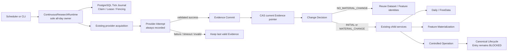
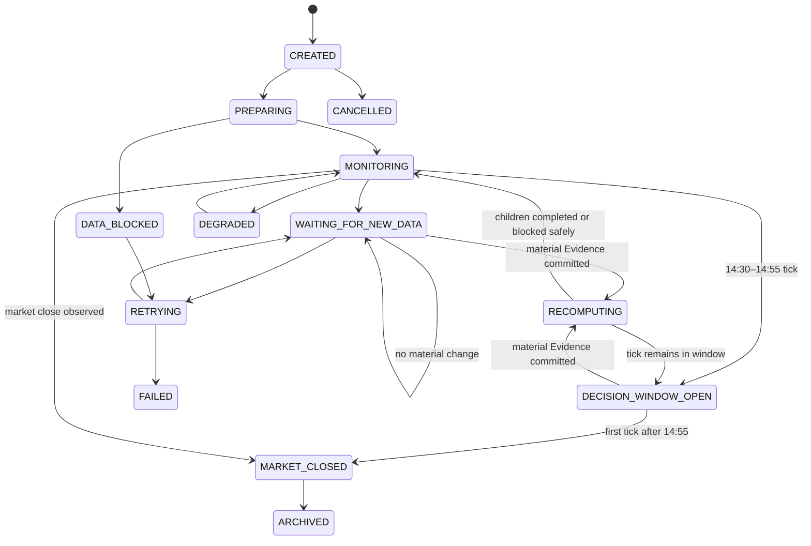

# WP-CRR-01 Continuous Research Runtime Design

> **Status:** CURRENT_SPECIFICATION
> **Authority:** Approved architecture and domain contract for WP-CRR-01 CRR-01 through CRR-06
> **Owner:** Market Regime Alpha maintainers
> **Last Updated:** 2026-08-06
> **Supersedes:** None
> **Superseded By:** None
> **Related Documents:** ../../audit/WP-CRR-01-CRR-00-Baseline.md, ../plans/2026-08-06-wp-crr-01-continuous-research-runtime.md
> **Code Evidence:** Design baseline `origin/main@8de820cd149278bfebbaf18f150a90f36380176d`; implementation evidence is added only after CRR-01–CRR-06 tests and commits

Authority ceiling: engineering runtime evidence with free/exploratory data;
Entry and all trading writes remain fail-closed.

## 1. Objective

Add one recoverable, PostgreSQL-authoritative Continuous Research Runtime that
owns all-day orchestration while composing the existing Daily/FreeData,
Controlled, Feature, and Canonical services. It records every provider poll as
an Attempt, advances research-consumable Evidence only after validation,
detects material change by content identity, and invokes existing downstream
services only for new material evidence.

The work package delivers the mechanics needed to sustain research updates. It
does not claim that free data is formal PIT evidence or that any current model
has economic value.

## 2. Scope

### 2.1 Included

- a versioned continuous runtime command and policy;
- the additive 14:30–14:55 decision-window state;
- PostgreSQL run/tick Journal, Claim, Lease, fencing, CAS, events, and recovery;
- Provider Attempt separated from validated Evidence Commit;
- last-valid Evidence pointer protected by CAS;
- material-change decisions and `NO_MATERIAL_CHANGE` reuse;
- request-scoped Universe and Eligibility foundations;
- research-only Orderability with fail-closed `ORDERABILITY_UNKNOWN`;
- parent/child lineage for Dataset, Feature, and Canonical attempts;
- Runner, CLI, replay/report, concurrency, restart, and acceptance tests.

### 2.2 Explicitly excluded

- `DailyDecisionWindowSummary`, blocked daily summary, or final buy summary;
- Market/Theme/Capital state machines and hysteresis;
- ETF/theme rotation lifecycle;
- Dynamic Stock Pool;
- Manual Account Observation and Reconciliation;
- Model Registry runtime selector;
- economic validation, ablation, or OOS qualification;
- Shadow Runtime or production scheduling;
- Opportunity, Order, BrokerOrder, automated/manual real Fill creation;
- Position mutation, QMT, MiniQMT, PTrade, XtQuant, or any Broker call;
- Web/UI/dashboard work.

## 3. Architectural decision

`ContinuousResearchRuntime` is the only all-day orchestration owner. It owns
when a tick is admitted, when a provider attempt is made, which Evidence Commit
is current, and whether downstream research should run. It does not own how
daily data, features, candidates, signals, forecasts, or canonical research are
computed.



Forbidden architecture:

- a second Provider implementation hidden under CRR;
- a second Dataset/Feature/Candidate/Signal/Forecast builder;
- direct writes to child Journals that bypass their services;
- CRR-generated Opportunity, Order, Fill, or Position state;
- a fallback SQLite CRR writer that can compete with PostgreSQL authority.

## 4. Time model and state machine

### 4.1 Additive decision-window policy

Introduce a new `ContinuousDecisionWindowPolicy` with a versioned timezone,
session phases, tick cadence, retry settings, provider budget, and decision
window. The default decision window is:

```text
Asia/Shanghai
open_at  = 14:30:00 inclusive
close_at = 14:55:00 inclusive
```

Any admitted tick whose localized observation time is within that interval may
project `DECISION_WINDOW_OPEN`. The policy does not require a tick at exactly
14:55:00. A first tick after the close moves to `MARKET_CLOSED`; no daily
summary is generated in this work package.

The existing `DecisionTimeOperationPolicy`, fixed 14:55 Target, TargetId,
Replay, and Reader remain byte- and behavior-compatible. CRR passes existing
commands to existing child services; it does not reinterpret historical target
time.

### 4.2 Runtime states



`DECISION_WINDOW_OPEN` is an operational state, not a decision, recommendation,
or summary. `DATA_BLOCKED` and `DEGRADED` are valid fail-closed outcomes.

### 4.3 Tick admission

Each trading date has one runtime run per command identity. The caller supplies
an aware observation time; the policy determines the session phase. Tick
identity is deterministic from run identity, localized observation time,
provider/configuration identity, and requested scope. A duplicate tick command
returns the existing tick.

Scheduling cadence belongs to a content-addressed configuration. The Runner
does not sleep indefinitely; a scheduler or bounded CLI invokes one tick at a
time. This makes tests deterministic and avoids treating the CLI process as
production scheduling proof.

## 5. Domain contracts

### 5.1 Continuous run and tick

`ContinuousResearchCommand`:

- trading date;
- request-scoped symbol set;
- observation policy identity and content hash;
- provider configuration identity and content hash;
- research configuration identity and content hash;
- calendar artifact identity/hash;
- idempotency key;
- authority limitations.

`RuntimeTick`:

- run ID, tick ID, and monotonic sequence;
- trading date and aware observed-at;
- session phase and projected run state;
- request scope hash;
- claim ID, fencing epoch, Lease times, and version;
- current Provider Attempt/Evidence/Change Decision references;
- terminal receipt or typed failure.

### 5.2 Provider Attempt

Every provider invocation produces an append-only `ProviderAttempt`, including
failed, timed-out, invalid, rate-limited, or circuit-open outcomes.

Required fields:

- run/tick/trading-date identity;
- provider/product/request identity and request hash;
- attempt number, claim ID, fencing epoch, started/completed times;
- result status: `SUCCEEDED`, `FAILED`, `TIMED_OUT`, `INVALID_RESPONSE`,
  `RATE_LIMITED`, or `CIRCUIT_OPEN`;
- raw response hash when bytes were observed;
- SourceManifest ID/hash only when constructed and validated;
- typed error/reason codes;
- retry disposition and provider revision.

A failed Attempt is evidence that polling failed; it is not research Evidence.

### 5.3 Evidence Commit

An immutable `EvidenceCommit` exists only after the provider response and
SourceManifest pass existing validation. It contains:

- Provider Attempt ID;
- SourceManifest ID/hash;
- raw/stage/archive Artifact IDs and hashes;
- normalized Evidence Artifact ID/hash;
- event/effective/retrieved/available/as-of times;
- field authority, quality, coverage, missing evidence, finality, adjustment,
  and free-data qualification;
- provider and configuration version;
- a canonical material identity hash.

Only an Evidence Commit may be proposed as the run's current Evidence. The
current pointer update is a versioned compare-and-swap transaction. A stale
fencing epoch, failed Attempt, missing commit, or mismatched run/scope is
rejected.

### 5.4 Change Decision

`ChangeDecisionType`:

- `INITIAL_EVIDENCE` — first validated Evidence for the scope;
- `MATERIAL_CHANGE` — canonical material identity differs from current;
- `NO_MATERIAL_CHANGE` — canonical material identity matches current;
- `DATA_INSUFFICIENT` — validated Evidence exists but cannot satisfy the
  minimum downstream contract.

The material identity is computed over normalized Evidence content,
SourceManifest semantic content, request scope, as-of semantics, and relevant
configuration/model versions. Transport timestamps, attempt IDs, Lease fields,
and retry counts do not cause a material change.

`NO_MATERIAL_CHANGE` records a decision and reuse references but MUST NOT:

- publish another Dataset;
- start another Feature materialization;
- start another Controlled or Canonical child run;
- change the current Evidence pointer to an identical commit.

### 5.5 RequestScopedUniverse

`RequestScopedUniverse` is an immutable, content-addressed view over the
existing operational Universe Artifact. It preserves all requested symbols,
included symbols, excluded symbols, reasons, source membership, PIT
qualification, and source manifest references. Its authority value is exactly:

```text
REQUEST_SCOPED_UNIVERSE
```

It cannot be relabeled as a complete A-share PIT universe. The Reader verifies
that included and excluded symbols partition the exact requested scope and that
the source Artifact/hash/configuration match the identity.

### 5.6 Eligibility and Orderability

Eligibility remains a research filtering fact separate from Candidate score.
The initial contract records one result for every requested symbol, including
excluded symbols and missing evidence. It may evaluate only facts present in
the supplied Evidence.

`OrderabilityStatus`:

- `ORDERABLE_FOR_RESEARCH`;
- `NOT_ORDERABLE`;
- `ORDERABILITY_UNKNOWN`.

`ORDERABLE_FOR_RESEARCH` never grants execution authority. Missing or
non-authoritative suspension, limit-state, valid-price, board-rule, lot-size,
listing-age, auction-phase, or liquidity evidence yields
`ORDERABILITY_UNKNOWN`; absence of evidence never defaults to orderable.

## 6. Parent/child lineage

Every downstream action is traceable through this chain:

```text
Trading Date
  → Continuous Run
    → Runtime Tick
      → Provider Attempt
        → SourceManifest
          → Evidence Commit
            → Change Decision
              → Input Artifact set + configuration versions
                → Dataset child/reference
                  → Feature child/reference
                    → Controlled child
                      → Canonical Research Attempt
```

For each Dataset, Feature, Controlled, and Canonical child reference, CRR stores:

- parent run/tick/attempt/commit/decision identities;
- child kind and existing child run/receipt identity;
- trading date;
- SourceManifest identity/hash;
- sorted input Artifact identity/hash set and aggregate hash;
- policy, provider, feature, research, model, and code configuration versions;
- whether the child is `CREATED` or `REUSED`;
- the immutable child receipt hash.

CRR stores references, not a shadow copy of each child Journal.

## 7. Domain invariants

1. One PostgreSQL CRR run is the only all-day orchestration owner for one
   trading date and command identity.
2. Every tick belongs to exactly one run and exact trading date.
3. Every provider invocation has exactly one append-only Attempt record.
4. Failed, timed-out, rate-limited, circuit-open, and invalid Attempts have no
   Evidence Commit and cannot move the current Evidence pointer.
5. Every Evidence Commit references exactly one successful validated Attempt.
6. The last valid Evidence remains readable after any later provider failure.
7. The current Evidence pointer changes only through CAS with the active
   fencing epoch.
8. A worker whose Lease expired cannot commit an Attempt result, Evidence,
   Change Decision, child reference, or tick receipt.
9. Duplicate run/tick/attempt/evidence commands are idempotent or conflict;
   they never silently diverge.
10. Identical material identity returns `NO_MATERIAL_CHANGE` and creates no new
    Dataset, Feature, Controlled, or Canonical child.
11. Dataset/Feature identity reuse requires exact Artifact, as-of,
    configuration, and source semantic identity.
12. Request scope is complete and immutable; excluded symbols remain recorded.
13. Missing orderability evidence yields `ORDERABILITY_UNKNOWN`.
14. `DECISION_WINDOW_OPEN` grants no recommendation or execution authority.
15. Existing fixed-14:55 Target/TargetId/Replay/Reader behavior is unchanged.
16. Entry remains fail-closed; CRR never creates Opportunity, Order, Fill, or
    Position state and never calls a Broker.
17. Free-data operation remains `FREE_DATA_EXPLORATORY` or weaker unless
    explicit formal evidence establishes more.
18. SQLite is not an alternative writer for CRR authority.

## 8. PostgreSQL table draft

Migration `020_continuous_research_runtime.sql` will add the following tables.
Names and constraints are implementation targets; no table below grants
trading authority.

### 8.1 `continuous_research_run`

Mutable CAS projection with immutable command identity:

- `run_id` primary key;
- unique `idempotency_key`;
- `command_hash`, `command_json`, trading date, scope hash;
- policy/provider/research configuration IDs and hashes;
- status, current tick sequence, version;
- created/updated/closed/archived timestamps;
- identity-immutability and no-delete triggers.

### 8.2 `continuous_runtime_tick`

Claimable task projection:

- `(run_id, tick_id)` primary key and unique sequence;
- idempotency key, observed-at, session phase, status;
- version, claim ID, fencing epoch, Lease/heartbeat timestamps;
- attempt/evidence/change/receipt references;
- typed error and retry-at;
- checks equivalent to existing Feature/Controlled claim invariants;
- terminal-tick immutability and no-delete triggers.

### 8.3 `continuous_provider_attempt`

Append-only attempt history:

- identity key and unique `(run_id, tick_id, attempt_number)`;
- claim/fencing/tick-version snapshot;
- provider/product/request hash;
- timing, terminal status, raw hash, optional SourceManifest reference;
- typed reason/error/retry fields;
- transition limited from `STARTED` to one terminal state; no delete.

### 8.4 `continuous_evidence_commit`

Append-only validated Evidence:

- evidence commit ID/hash;
- unique successful Attempt reference;
- run/tick/trading date/scope;
- SourceManifest and evidence Artifact IDs/hashes;
- material identity hash and canonical JSON;
- effective/retrieved/available/as-of times and quality ceiling;
- no update/delete triggers.

### 8.5 `continuous_current_evidence`

Small mutable CAS pointer:

- `(run_id, evidence_scope)` primary key;
- evidence commit ID/hash and material identity hash;
- version and updated-at;
- last accepted fencing epoch;
- foreign key to a commit in the same run/scope;
- update guard that rejects non-monotonic versions/epochs.

It is the only mutable representation of "last valid Evidence". History remains
in immutable commit and event rows.

### 8.6 `continuous_change_decision`

Append-only decision history:

- decision ID/hash;
- run/tick/attempt/commit/current-previous commit references;
- decision type and reason codes;
- prior/current material hashes;
- canonical decision JSON and creation time;
- unique decision per tick and no update/delete triggers.

### 8.7 `continuous_child_run`

Append-only lineage references:

- parent run/tick/change-decision identity;
- child kind: `DAILY_DATASET`, `FEATURE_MATERIALIZATION`,
  `CONTROLLED_OPERATION`, or `CANONICAL_LIFECYCLE`;
- reference disposition: `CREATED` or `REUSED`;
- child run/receipt/artifact identities and hashes;
- SourceManifest, aggregate input, and configuration hashes;
- uniqueness preventing duplicate semantic children; no update/delete.

### 8.8 `continuous_runtime_event`

Append-only event stream for run/tick/claim/heartbeat/attempt/evidence/change/
child/recovery/state transitions. Payload is canonical JSON and event ordering
uses a database-generated identity.

## 9. Repository and transaction boundaries

One `PostgresContinuousResearchRepository` uses the same
`PostgresConnectionFactory` as existing repositories.

Atomic operations:

- create-or-load run;
- admit duplicate-safe tick;
- claim/reclaim tick with `FOR UPDATE SKIP LOCKED`, new fencing epoch, and Lease;
- heartbeat active claim;
- finish Provider Attempt only under current claim/epoch;
- record Evidence Commit and CAS current pointer in one transaction;
- record Change Decision;
- record child reference only after existing child receipt is durable;
- complete/fail tick with immutable receipt;
- recover expired claims without deleting history.

The repository rejects a stale claim at every write boundary, not only at final
completion. No schema-wide lock is used. Claim selection locks only candidate
rows.

## 10. Migration plan

1. Add migration `020_continuous_research_runtime.sql`; do not edit migrations
   `001`–`019`.
2. Add all tables, checks, indexes, foreign keys, mutation guards, and triggers
   in one forward migration.
3. Extend the allowed runtime binding scope with `CONTINUOUS_RESEARCH` through
   the migration, preserving all current scope values.
4. Update the migration manifest/schema table expectations and tests from 19 to
   20 migrations and from the observed authority table count to the exact new
   count.
5. Prove a fresh apply and verify-only pass on an isolated PostgreSQL 16.14
   database.
6. Prove replay/idempotent migrator behavior; migration failure is
   forward-repaired by a new migration, never by editing a published migration.

No SQLite migration is added because PostgreSQL is the sole CRR write
authority. Existing SQLite readers and compatibility code remain unchanged.

## 11. Recovery and concurrency

Recovery scans only non-terminal ticks whose Lease has expired. Reclaim:

- marks the old started Attempt `LEASE_EXPIRED` when applicable;
- emits an immutable recovery event;
- assigns a new claim ID and strictly larger fencing epoch;
- preserves previous raw hashes/errors;
- resumes from the first missing durable boundary.

If an Evidence Commit and current-pointer CAS are already durable, recovery
does not poll or publish it again. If a child receipt is already durable but the
CRR child reference is absent, recovery verifies the receipt and records the
missing reference. If no durable boundary exists, recovery retries according
to policy.

Two workers claiming the same tick must yield one winner. The loser observes
either no claimable row or a stale-fence conflict. A late provider response from
the loser is recorded only if its Attempt completion is still authorized;
otherwise it is rejected and cannot affect Evidence.

## 12. Runner and CLI

Application interfaces:

- `prepare-continuous-research`: create/load a run after calendar and scope
  validation;
- `run-continuous-research-tick`: admit and execute one bounded tick;
- `resume-continuous-research`: reclaim or continue pending work;
- `report-continuous-research`: deterministic JSON status/lineage report;
- `replay-continuous-research`: read-only verification of receipts and child
  lineage.

The Runner receives provider acquisition and child-service ports. Production
composition wires the existing implementations. Tests may use scripted ports
only as engineering fixtures and label their receipts accordingly.

CLI commands require `MARKET_REGIME_ALPHA_DATABASE_URL` or an explicit database
URL according to the existing settings contract, fail closed when PostgreSQL is
missing, and never default to an unknown local database.

## 13. Test matrix

| Area | Required proof |
| --- | --- |
| Policy | timezone-aware validation; 14:29:59 outside; 14:30 and 14:55 inside; 14:55:01 outside; lunch/session behavior; no exact-14:55 requirement |
| Compatibility | existing DecisionTime policy, fixed 14:55 TargetId, Reader, Replay fixtures unchanged |
| Domain identity | canonical round trip; tamper rejection; stable hashes; sorted request scope; config/as-of sensitivity |
| Universe | exact requested partition; excluded symbols retained; no complete-PIT label |
| Orderability | missing suspension/limit/price/board/lot/liquidity evidence gives `ORDERABILITY_UNKNOWN`; no execution authority |
| Migration | contiguous 001–020; fresh apply; verify-only; expected table/index/trigger checks; binding scope extension |
| Run Journal | idempotent create/load; immutable identity conflict; CAS versions; no delete |
| Lease/fencing | one claim winner; heartbeat; expiry/reclaim; stale writer rejected at Attempt, Evidence, child, and receipt boundaries |
| Provider Attempt | success/failure/timeout/invalid/rate-limit/circuit-open all recorded; only success may commit Evidence |
| Evidence isolation | failed later Attempt leaves current Evidence byte-identical and readable |
| Material change | identical canonical inputs produce `NO_MATERIAL_CHANGE`; transport time ignored; semantic/config/as-of change detected |
| Reuse | no Dataset/Feature/Controlled/Canonical invocation on no-change; prior identities returned as `REUSED` |
| Lineage | every created/reused Dataset, Feature, Controlled, and Canonical reference traces to date/tick/Attempt/Manifest/inputs/config |
| Runner | first evidence, changed evidence, no change, blocked evidence, provider recovery, child blocked, restart after every durable boundary |
| CLI | prepare/tick/resume/report/replay success; invalid DSN/config/scope fail closed; structured JSON stable |
| Concurrency | two processes/workers race a tick; only one Evidence commit/current pointer/child invocation |
| Regression | full PostgreSQL suite; full pytest; docs links; Ruff; mypy; build |
| Authority ceiling | no Broker modules invoked; no Opportunity/Order/Fill/Position rows; Entry blocker remains terminal |

## 14. Delivery phases

### CRR-01 — contracts and design

Deliver this specification, state machine, invariants, database draft, migration
plan, test matrix, and pure domain contracts.

### CRR-02 — PostgreSQL Journal

Deliver migration 020, repository, binding, Claim/Lease/fencing/CAS,
idempotency, events, and recovery primitives.

### CRR-03 — Attempt/Evidence isolation

Deliver append-only Provider Attempts, validated Evidence Commits, last-valid
pointer, failure isolation, and recovery tests.

### CRR-04 — change identity and reuse

Deliver canonical material hashing, `NO_MATERIAL_CHANGE`, and downstream
Dataset/Feature identity reuse without duplicate child execution.

### CRR-05 — scope and orderability

Deliver RequestScopedUniverse, per-symbol Eligibility basis, Orderability
contract, and `ORDERABILITY_UNKNOWN` fail-closed behavior.

### CRR-06 — composition and acceptance

Deliver bounded Runner and CLI, existing-service adapters, restart/concurrency/
replay tests, exact-HEAD regression gates, and authority-ceiling evidence.

## 15. Rollback and forward repair

Before publication, an unreferenced local migration may be replaced along with
its tests. After publication, migration 020 is immutable; corrections use 021+
forward repair. Runtime enablement is additive: not invoking the CRR CLI leaves
existing FreeData/Controlled behavior unchanged. CRR rows and immutable
Artifacts are never deleted to roll back application code.

## 16. Acceptance and non-claims

WP-CRR-01 is complete only when:

- CRR-00 baseline and the 41 PostgreSQL-dependent cases pass in isolation;
- all phase contracts are implemented and tested on PostgreSQL;
- failed Attempts provably cannot replace last valid Evidence;
- no-change ticks provably create no duplicate Dataset/Feature/Canonical work;
- lineage is complete for created and reused children;
- concurrency and crash recovery are proven on PostgreSQL;
- all final gates pass on the exact implementation HEAD;
- documentation states the free-data, PIT, Alpha, and trading ceilings.

Completion will not mean formal Provider qualification, formal PIT, calibrated
probabilities, economic Alpha, production scheduling, Shadow readiness, or any
trading/Broker authority.
